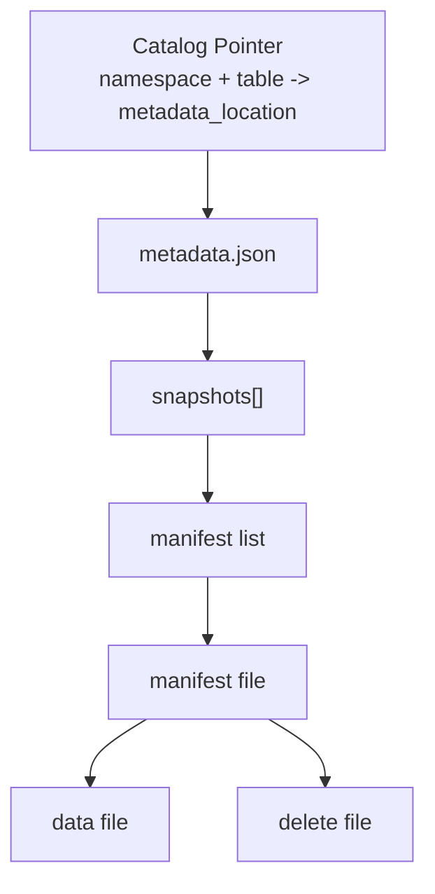
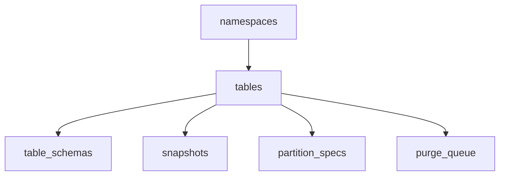

# GaussVector Iceberg Catalog 元信息表设计

## 1. 文档目标

本文档定义 GaussVector 首期 Iceberg Catalog 元信息表设计，重点说明以下内容：

1. Iceberg 原生元信息范围及结构。
2. 首期缓存边界与不缓存内容。
3. 元信息表 Schema、字段定义、索引设计及与 Iceberg 元信息的对应关系。
4. 可直接执行的初始化 DDL。

本文档只讨论 Schema 设计，不展开升级机制、事务一致性实现、核心操作流程和运维细节。

## 2. 设计范围

首期支持范围如下：

| 对象 | 首期能力 |
| --- | --- |
| Namespace | `create`、`list`、`load`、`drop`、`exists` |
| Table | `create`、`list`、`load`、`drop`、`exists`、`rename`、`commit` |
| Schema 变更 | 作为 Table metadata 的一部分处理，首期仅支持加列 |

首期不包含以下内容：

1. 多 Catalog 隔离。
2. 审计体系。
3. 业务索引元信息。
4. Manifest / Data File 明细落表。
5. 完整回滚与历史恢复机制。

## 3. 设计原则

### 3.1 权威来源

Iceberg 表的唯一权威元信息是对象存储中的 `metadata.json` 及其引用链路。数据库元信息表不是第二份权威数据，而是用于：

1. 保存 Catalog 对象映射关系。
2. 缓存高频结构摘要。

### 3.2 缓存边界

数据库仅缓存以下信息：

1. Catalog 定位信息：`namespace`、`table_name`、`metadata_location` 等。
2. 高频结构信息：Schema、Partition Spec、Snapshot 摘要。

数据库不完整缓存以下信息：

1. `metadata.json` 原文。
2. `properties`、`refs`、`snapshot-log`、`metadata-log` 的完整内容。
3. Sort Order 历史。
4. Manifest List 内容、Manifest File、Data File、Delete File 明细。

其中 Sort Order 需要特别说明：首期不建立独立缓存表。如 `load_table` 需要返回完整 Iceberg metadata，则运行时从当前 `metadata.json` 解析 `default-sort-order-id` 和 `sort-orders[]` 并透传。

### 3.3 建模约束

1. 顶层高频结构优先展开，便于直接评审和查询。
2. 对已明确不拆表且不保留 JSONB 的一对多结构，采用单表展开模型。
3. 字段说明与 Iceberg 来源映射分开表达，避免重复。
4. 非 Iceberg 原生字段必须明确标识为内部控制字段。

## 4. Iceberg 原生元信息概览

本章仅给出 Iceberg 原生元信息的整体结构和首期处理边界，便于评审先建立全局认知。各类元信息的具体字段说明、对应 JSON 片段和数据库映射关系，在第 6 章对应表设计中展开；未缓存字段在第 7 章统一说明。

### 4.1 文件链路

Iceberg 表由一组存在明确引用关系的元信息文件与数据文件组成。



对 Catalog 而言，最关键的是 `metadata_location` 与 `metadata.json` 顶层结构；底层文件链路主要用于查询规划、清理和排障，不适合作为首期数据库缓存主体。

### 4.2 `metadata.json` 顶层字段总体去向

#### 已缓存字段

| 原生字段 | 作用 | 首期处理 |
| --- | --- | --- |
| `table-uuid` | 表稳定身份 | `tables.table_uuid` |
| `location` | 表根路径 | `tables.table_location` |
| `last-column-id` | 当前最大列 ID | `tables.last_column_id` |
| `schemas` | Schema 历史数组 | `table_schemas` |
| `current-schema-id` | 当前 Schema 指针 | `tables.current_schema_id` |
| `partition-specs` | Partition Spec 历史数组 | `partition_specs` |
| `default-spec-id` | 当前默认 Partition Spec 指针 | `tables.default_spec_id` |
| `current-snapshot-id` | 当前 Snapshot 指针 | `tables.current_snapshot_id` |
| `snapshots` | Snapshot 历史数组 | 高频摘要缓存到 `snapshots` |

#### 未缓存字段

| 原生字段 | 作用 | 首期处理 |
| --- | --- | --- |
| `format-version` | 表格式版本 | 读取 `metadata.json` 时直接识别和校验 |
| `last-updated-ms` | 当前 metadata 更新时间 | 读取完整 metadata 时按需识别 |
| `last-partition-id` | 当前最大 Partition Field ID | 提交校验时按需读取 |
| `sort-orders` | Sort Order 历史数组 | `load_table` 时直接解析 |
| `default-sort-order-id` | 当前默认 Sort Order 指针 | `load_table` 时直接识别 |
| `properties` | 表级开放属性集合 | `load_table` 透传，提交时按需更新 |
| `snapshot-log` | Snapshot 事件历史 | `load_table` 时透传 |
| `metadata-log` | metadata 文件演进历史 | `load_table` 时透传 |
| `refs` | Branch / Tag 引用与策略 | `load_table` 透传，相关提交动作时按需处理 |
| `statistics` | 表级统计文件引用 | 读取完整 metadata 时按需识别 |
| `partition-statistics` | 分区统计文件引用 | 读取完整 metadata 时按需识别 |
| `next-row-id` | Row lineage 下一可分配 ID | 当前首期不使用 |

#### 待确认字段

| 原生字段 | 作用 | 当前状态 |
| --- | --- | --- |
| `last-sequence-number` | 表级最大 sequence number | 当前设计保留为 `tables.last_sequence_number`，后续按首期范围决定是否删除 |

## 5. 元信息表总体设计

### 5.1 总体结构



### 5.2 表与元信息映射

| 表 | 类型 | 对应内容 | 说明 |
| --- | --- | --- | --- |
| `namespaces` | Catalog 对象表 | Namespace | 不属于 `metadata.json`，属于 Catalog 层对象 |
| `tables` | 核心映射表 | `metadata.json` 顶层摘要 | 保存表名、当前 metadata 指针及当前版本指针 |
| `table_schemas` | 高频缓存表 | `schemas[]` | 按顶层字段展开 |
| `snapshots` | 高频缓存表 | `snapshots[]` 摘要 | 只缓存高频字段 |
| `partition_specs` | 高频缓存表 | `partition-specs[]` | 单表展开 |
| `purge_queue` | 内部控制表 | 异步清理任务 | 不属于 Iceberg 原生元信息 |

## 6. 表设计

本章按“表说明 -> 字段说明 -> 对应对象与字段来源 -> 缓存范围说明 -> 索引说明”的顺序展开。对于存在边界尚未完全收敛的字段或表，统一在对应小节中以“待确认项”说明其适用场景和是否建议首期保留。

### 6.1 `namespaces`

```sql
CREATE TABLE iceberg_catalog.namespaces (
    namespace       TEXT PRIMARY KEY,
    properties      JSONB NOT NULL DEFAULT '{}'::JSONB,
    CHECK (jsonb_typeof(properties) = 'object')
);
```

#### 表说明

`namespaces` 用于承载 Catalog 层 Namespace 对象。该表不对应表级 `metadata.json`，而是用于表达 Namespace 身份和扩展属性。

对应的原生对象示例：

```json
{
  "namespace": ["accounting"],
  "properties": {
    "location": "s3://warehouse/accounting",
    "owner": "finance-team"
  }
}
```

#### 字段说明

| 字段 | 类型 | 约束 | 说明 |
| --- | --- | --- | --- |
| `namespace` | `TEXT` | 主键 | Namespace 的唯一逻辑标识。 |
| `properties` | `JSONB` | 非空，默认空对象 | Namespace 扩展属性集合。 |

#### 对应的完整原生对象

| 字段 | 对应来源 | 路径 | 说明 |
| --- | --- | --- | --- |
| `namespace` | Catalog Namespace 标识 | Namespace name | 不在 `metadata.json` 中 |
| `properties` | Catalog Namespace 属性 | Namespace properties | 不在 `metadata.json` 中 |

#### 缓存范围说明

`namespaces` 对应的是 Catalog 层 Namespace 对象，而不是 `metadata.json` 内部对象。首期对 Namespace 的处理较为直接：

1. 已缓存：`namespace`、`properties`。
2. 未缓存：无。当前 Namespace 对象不再拆出独立子表，也不保留额外运行时副本。

#### 推荐属性键

| 属性键 | 用途 |
| --- | --- |
| `location` | Namespace 默认存储路径 |
| `comment` | Namespace 描述 |
| `owner` | 逻辑负责人 |

#### 索引说明

| 索引来源 | 定义 | 说明 |
| --- | --- | --- |
| 主键 | `PRIMARY KEY (namespace)` | 覆盖 Namespace 精确读取和有序枚举。 |

首期不建议为 `properties` 建立 JSONB GIN 索引。

### 6.2 `tables`

```sql
CREATE TABLE iceberg_catalog.tables (
    -- TODO: relid 是否保留待确认；若首期不需要本地 relation 绑定，可删除该字段及其唯一约束
    relid                       REGCLASS,
    namespace                   TEXT NOT NULL,
    table_name                  TEXT NOT NULL,
    table_uuid                  UUID NOT NULL,
    metadata_location           TEXT NOT NULL,
    table_location              TEXT NOT NULL,
    -- TODO: last_sequence_number 是否保留待确认；若后续支持更完整的 Iceberg V2 提交语义或 sequence number 校验，建议保留
    last_sequence_number        BIGINT NOT NULL DEFAULT 0,
    last_column_id              INT NOT NULL,
    current_schema_id           INT,
    current_snapshot_id         BIGINT,
    default_spec_id             INT,
    PRIMARY KEY (namespace, table_name),
    UNIQUE (table_uuid),
    UNIQUE (relid),
    FOREIGN KEY (namespace)
        REFERENCES iceberg_catalog.namespaces(namespace)
        ON DELETE RESTRICT
);
```

#### 表说明

`tables` 是核心元信息表，用于承接 `namespace + table_name -> metadata_location` 的映射关系，并保存当前表状态摘要。

待确认项：

1. `relid` 是否保留待确认。若首期仅关注纯 Catalog 元信息映射，而不需要与本地 PostgreSQL relation 稳定绑定，则可删除。
2. `last_sequence_number` 是否保留待确认。若首期仅支持基础 Catalog 操作，可不单独缓存；若后续需要更完整的 Iceberg V2 提交语义，则建议保留。

由于 `table_schemas` 和 `partition_specs` 采用单表展开模型，`current_schema_id` 与 `default_spec_id` 当前不建立数据库外键。`create_table` 和 `commit_table` 必须在同一事务内校验：对应的 Schema 版本占位记录和 Partition Spec 版本占位记录已经存在。

对应的 `metadata.json` 顶层字段示例：

```json
{
  "table-uuid": "11111111-1111-1111-1111-111111111111",
  "location": "s3://warehouse/demo/orders",
  "last-column-id": 2,
  "current-schema-id": 0,
  "default-spec-id": 0,
  "current-snapshot-id": 1001,
  "last-sequence-number": 1
}
```

#### 字段说明

| 字段 | 类型 | 约束 | 说明 |
| --- | --- | --- | --- |
| `relid` | `REGCLASS` | 唯一，可空 | 待确认是否保留。用于关联本地 PostgreSQL relation。 |
| `namespace` | `TEXT` | 非空，外键 | 表所属 Namespace 标识，与 `table_name` 共同构成逻辑主键。 |
| `table_name` | `TEXT` | 非空 | 表在 Catalog 中的逻辑名称。 |
| `table_uuid` | `UUID` | 非空，唯一 | 表的稳定唯一标识。 |
| `metadata_location` | `TEXT` | 非空 | 当前生效元信息文件路径，是定位表当前状态的核心指针。 |
| `table_location` | `TEXT` | 非空 | 表根路径，对应当前表 metadata 中的 `location`。 |
| `last_sequence_number` | `BIGINT` | 非空，默认 `0` | 待确认是否保留。用于保存当前表级 sequence number 摘要。 |
| `last_column_id` | `INT` | 非空 | 当前已分配的最大列 ID，用于加列等 Schema 演进场景。 |
| `current_schema_id` | `INT` | 可空 | 当前生效的 Schema 版本。 |
| `current_snapshot_id` | `BIGINT` | 可空 | 当前生效的 Snapshot 版本；空表场景允许为空。 |
| `default_spec_id` | `INT` | 可空 | 当前默认分区规则版本。 |

#### 对应的完整原生对象

| 字段 | 对应来源 | 路径 | 说明 |
| --- | --- | --- | --- |
| `relid` | 无 | 无 | 待确认是否保留的内部字段 |
| `namespace` | Catalog 表标识 | Table identifier.namespace | 不在 `metadata.json` 中 |
| `table_name` | Catalog 表标识 | Table identifier.name | 不在 `metadata.json` 中 |
| `table_uuid` | 表稳定身份 | `metadata.json.table-uuid` | 直接对应 |
| `metadata_location` | 当前 metadata 指针 | Catalog pointer | 指向当前 `metadata.json` |
| `table_location` | 表根路径 | `metadata.json.location` | 直接对应 |
| `last_sequence_number` | 表级最大序号 | `metadata.json.last-sequence-number` | 待确认是否保留 |
| `last_column_id` | 当前最大列 ID | `metadata.json.last-column-id` | 直接对应 |
| `current_schema_id` | 当前 Schema 指针 | `metadata.json.current-schema-id` | 直接对应 |
| `current_snapshot_id` | 当前 Snapshot 指针 | `metadata.json.current-snapshot-id` | 直接对应 |
| `default_spec_id` | 当前 Spec 指针 | `metadata.json.default-spec-id` | 直接对应 |

`tables` 对应的是一张 Iceberg 表的顶层 `metadata.json` 摘要，以及 Catalog 层的表标识信息。完整 `metadata.json` 顶层通常包含：

- `format-version`
- `table-uuid`
- `location`
- `last-sequence-number`
- `last-updated-ms`
- `last-column-id`
- `schemas`
- `current-schema-id`
- `partition-specs`
- `default-spec-id`
- `last-partition-id`
- `sort-orders`
- `default-sort-order-id`
- `properties`
- `current-snapshot-id`
- `snapshots`
- `snapshot-log`
- `metadata-log`
- `refs`
- `statistics`
- `partition-statistics`
- `next-row-id`

#### 缓存范围说明

`tables` 只缓存顶层对象中的当前定位字段和当前版本指针，不保存完整 `metadata.json`。

已缓存：

1. `table-uuid`
2. `location`
3. `metadata_location`
4. `last-sequence-number`（待确认是否保留）
5. `last-column-id`
6. `current-schema-id`
7. `current-snapshot-id`
8. `default-spec-id`
9. Catalog 层 `namespace`、`table_name`

未缓存在本表：

1. `format-version`
2. `last-updated-ms`
3. `last-partition-id`
4. `default-sort-order-id`
5. `properties`
6. `sort-orders`
7. `snapshot-log`
8. `metadata-log`
9. `refs`
10. `statistics`
11. `partition-statistics`
12. `next-row-id`

其中 `schemas`、`partition-specs`、`snapshots` 三类历史数组不在 `tables` 表中保存，而是分别展开到 `table_schemas`、`partition_specs`、`snapshots`。

#### 待确认字段使用场景

1. `relid`
   适用于需要将 Iceberg Catalog 表与本地 PostgreSQL relation 建立稳定绑定的场景，例如通过 relation OID 反查 Catalog 表、在执行层按本地对象定位 Iceberg 表、或者内部表生命周期需要与 PostgreSQL 对象联动。若首期仅提供纯 Catalog 元信息能力，不依赖本地 relation，则可删除。
2. `last_sequence_number`
   适用于需要增强 Iceberg V2 提交语义的场景，例如提交时分配新的 sequence number、校验 sequence number 演进、支持 Delete File 相关校验、或者后续扩展到更完整的 V2 requirement 处理。若首期仅支持基础 `load_table`、`commit_table` 和加列，不在数据库侧消费 sequence number 语义，则可不单独缓存。

#### 索引说明

| 索引来源 | 定义 | 说明 |
| --- | --- | --- |
| 主键 | `PRIMARY KEY (namespace, table_name)` | 覆盖 `load_table(namespace, table_name)`，并利用左前缀支持按 Namespace 列表查询。 |
| 唯一约束 | `UNIQUE (table_uuid)` | 支持按表稳定标识关联子表和内部定位。 |
| 唯一约束 | `UNIQUE (relid)` | 仅在保留 `relid` 时有效。 |

首期不建议单独为 `current_schema_id`、`current_snapshot_id`、`default_spec_id` 建立附加索引。

### 6.3 `table_schemas`

```sql
CREATE TABLE iceberg_catalog.table_schemas (
    table_uuid          UUID NOT NULL,
    schema_id           INT NOT NULL,
    attribute_position  INT NOT NULL,
    attribute_id        INT,
    attribute_name      TEXT,
    attribute_required  BOOLEAN,
    attribute_type      TEXT,
    attribute_doc       TEXT,
    PRIMARY KEY (table_uuid, schema_id, attribute_position),
    UNIQUE (table_uuid, schema_id, attribute_id),
    FOREIGN KEY (table_uuid)
        REFERENCES iceberg_catalog.tables(table_uuid)
        ON DELETE CASCADE,
    CHECK (
        (attribute_position = -1
            AND attribute_id IS NULL
            AND attribute_name IS NULL
            AND attribute_required IS NULL
            AND attribute_type IS NULL
            AND attribute_doc IS NULL)
        OR
        (attribute_position >= 0
            AND attribute_id IS NOT NULL
            AND attribute_name IS NOT NULL
            AND attribute_required IS NOT NULL
            AND attribute_type IS NOT NULL)
    )
);
```

#### 表说明

`table_schemas` 用于缓存 `schemas[]`。当前设计不保留整段 `schema_json`，而是按顶层字段展开；复杂类型不继续递归拆表，而是保存为规范化类型表达。

对应的原生 JSON 片段示例：

```json
{
  "type": "struct",
  "schema-id": 0,
  "fields": [
    {"id": 1, "name": "order_id", "required": true, "type": "long"},
    {"id": 2, "name": "amount", "required": false, "type": "decimal(12,2)"}
  ]
}
```

#### 字段说明

| 字段 | 类型 | 约束 | 说明 |
| --- | --- | --- | --- |
| `table_uuid` | `UUID` | 主键组成，外键 | 标识该 Schema 版本所属的表。 |
| `schema_id` | `INT` | 主键组成 | 同一张表内 Schema 历史版本标识。 |
| `attribute_position` | `INT` | 主键组成 | `-1` 表示版本占位记录；`>= 0` 表示实际顶层字段，并按该顺序还原字段列表。 |
| `attribute_id` | `INT` | 可空，版本内唯一 | 字段稳定标识。 |
| `attribute_name` | `TEXT` | 可空 | 顶层字段名称。 |
| `attribute_required` | `BOOLEAN` | 可空 | 字段是否必填。 |
| `attribute_type` | `TEXT` | 可空 | 字段类型定义；复杂类型以规范化文本表示。 |
| `attribute_doc` | `TEXT` | 可空 | 字段说明文本。 |

#### 对应的完整原生对象

| 字段 | 对应来源 | 路径 | 说明 |
| --- | --- | --- | --- |
| `table_uuid` | 表稳定身份 | `metadata.json.table-uuid` | 绑定表 |
| `schema_id` | Schema 版本 ID | `metadata.json.schemas[].schema-id` | 直接对应 |
| `attribute_position` | 字段顺序 | `metadata.json.schemas[].fields[]` 数组顺序 | `-1` 为内部控制值；`>= 0` 为字段顺序位置 |
| `attribute_id` | 字段 ID | `metadata.json.schemas[].fields[].id` | 直接对应 |
| `attribute_name` | 字段名 | `metadata.json.schemas[].fields[].name` | 直接对应 |
| `attribute_required` | 必填标记 | `metadata.json.schemas[].fields[].required` | 直接对应 |
| `attribute_type` | 字段类型 | `metadata.json.schemas[].fields[].type` | 原子类型直接保存，复杂类型规范化保存 |
| `attribute_doc` | 字段说明 | `metadata.json.schemas[].fields[].doc` | 原生可选字段 |

`table_schemas` 对应的是 `metadata.json.schemas[]` 中的单个 Schema 对象。完整对象通常包含：

- `type`
- `schema-id`
- `identifier-field-ids`
- `fields[]`

其中 `fields[]` 内部字段通常包含：

- `id`
- `name`
- `required`
- `type`
- `doc`

#### 缓存范围说明

`table_schemas` 对 `schemas[]` 采用顶层展开缓存，不保留原始 JSON。

已缓存：

1. `schema-id`
2. `fields[].id`
3. `fields[].name`
4. `fields[].required`
5. `fields[].type`
6. `fields[].doc`
7. `fields[]` 的数组顺序

未缓存：

1. `type` 固定结构标识，不单独落表
2. `identifier-field-ids`
3. 复杂类型的递归子结构不继续拆表，仅规范化写入 `attribute_type`
4. 原始 `schema_json`

#### 索引说明

| 索引来源 | 定义 | 说明 |
| --- | --- | --- |
| 主键 | `PRIMARY KEY (table_uuid, schema_id, attribute_position)` | 覆盖按表和 Schema 版本顺序还原字段列表。 |
| 唯一约束 | `UNIQUE (table_uuid, schema_id, attribute_id)` | 保证同一 Schema 版本内字段 ID 唯一。 |

### 6.4 `snapshots`

```sql
CREATE TABLE iceberg_catalog.snapshots (
    table_uuid          UUID NOT NULL,
    snapshot_id         BIGINT NOT NULL,
    schema_id           INT,
    -- TODO: 非首期必需字段；如需表达 Snapshot 版本链，再保留该字段
    parent_snapshot_id  BIGINT,
    -- TODO: 非首期必需字段；如需增强 Iceberg V2 sequence number 语义兼容，再保留该字段
    sequence_number     BIGINT,
    timestamp_ms        BIGINT NOT NULL,
    manifest_list       TEXT,
    -- TODO: 非首期必需字段；如需高频识别提交类型，再保留该字段
    operation           TEXT,
    PRIMARY KEY (table_uuid, snapshot_id),
    FOREIGN KEY (table_uuid)
        REFERENCES iceberg_catalog.tables(table_uuid)
        ON DELETE CASCADE
);
```

#### 表说明

`snapshots` 用于缓存 `snapshots[]` 的高频摘要，不替代完整 `snapshot-log`。

待确认项：`parent_snapshot_id`、`sequence_number`、`operation` 目前均不属于首期绝对必需字段。如首期仅保留最小 Snapshot 摘要，可只缓存 `snapshot_id`、`timestamp_ms`、`manifest_list`；如后续需要增强版本链分析、V2 提交语义兼容或高频操作类型识别，再保留这三个字段。

当前设计保留 `schema_id`。Iceberg Snapshot 原生对象可包含可选 `schema-id` 字段，用于标识该 Snapshot 对应的 Schema 上下文。首期即使暂不直接消费该字段，也建议保留，以便后续支持历史 Snapshot 与 Schema 的直接关联分析。

对应的原生 JSON 片段示例：

```json
{
  "sequence-number": 1,
  "snapshot-id": 1001,
  "schema-id": 0,
  "parent-snapshot-id": 1000,
  "timestamp-ms": 1717200000000,
  "manifest-list": "s3://warehouse/demo/orders/metadata/snap-1001.avro",
  "summary": {
    "operation": "append"
  }
}
```

#### 字段说明

| 字段 | 类型 | 约束 | 说明 |
| --- | --- | --- | --- |
| `table_uuid` | `UUID` | 主键组成，外键 | 标识该 Snapshot 所属的表。 |
| `snapshot_id` | `BIGINT` | 主键组成 | Snapshot 唯一标识。 |
| `schema_id` | `INT` | 可空 | Snapshot 对应的 Schema 版本标识。 |
| `parent_snapshot_id` | `BIGINT` | 可空 | 非首期必需字段。用于描述 Snapshot 版本链关系。 |
| `sequence_number` | `BIGINT` | 可空 | 非首期必需字段。用于保存 Snapshot 对应的 sequence number 摘要。 |
| `timestamp_ms` | `BIGINT` | 非空 | Snapshot 生成时间，单位为毫秒。 |
| `manifest_list` | `TEXT` | 可空 | 当前 Snapshot 关联的 Manifest List 路径。 |
| `operation` | `TEXT` | 可空 | 非首期必需字段。用于保存高频操作类型摘要。 |

#### 对应的完整原生对象

| 字段 | 对应来源 | 路径 | 说明 |
| --- | --- | --- | --- |
| `table_uuid` | 表稳定身份 | `metadata.json.table-uuid` | 绑定表 |
| `snapshot_id` | Snapshot ID | `metadata.json.snapshots[].snapshot-id` | 直接对应 |
| `schema_id` | Schema 版本 ID | `metadata.json.snapshots[].schema-id` | 原生可选字段；当前保留该字段。 |
| `parent_snapshot_id` | 父 Snapshot ID | `metadata.json.snapshots[].parent-snapshot-id` | 非首期必需字段，后续如需表达版本链再保留。 |
| `sequence_number` | Snapshot 序号 | `metadata.json.snapshots[].sequence-number` | 非首期必需字段，后续如需增强 V2 语义兼容再保留。 |
| `timestamp_ms` | Snapshot 时间 | `metadata.json.snapshots[].timestamp-ms` | 直接对应 |
| `manifest_list` | Manifest List 路径 | `metadata.json.snapshots[].manifest-list` | 直接对应 |
| `operation` | 提交类型 | `metadata.json.snapshots[].summary.operation` | 非首期必需字段，后续如需高频操作摘要再保留。 |

`snapshots` 对应的是 `metadata.json.snapshots[]` 中的单个 Snapshot 对象。完整对象通常包含：

- `sequence-number`
- `snapshot-id`
- `schema-id`
- `parent-snapshot-id`
- `timestamp-ms`
- `manifest-list`
- `summary`

其中 `summary` 为开放键值集合，常见内容包括 `operation`、新增/删除文件数和行数等。

#### 缓存范围说明

`snapshots` 只缓存 Snapshot 高频摘要，不缓存完整 `summary` 和下层文件明细。

已缓存：

1. `snapshot-id`
2. `schema-id`
3. `parent-snapshot-id`（待确认是否保留）
4. `sequence-number`（待确认是否保留）
5. `timestamp-ms`
6. `manifest-list`
7. `summary.operation`（待确认是否保留）

未缓存：

1. `summary` 中除 `operation` 外的其他键
2. `snapshot-log`
3. Manifest List 内容
4. Manifest File 明细
5. Data File / Delete File 明细
6. 原始 Snapshot JSON

#### 待确认字段使用场景

1. `parent_snapshot_id`
   适用于需要在数据库侧直接分析 Snapshot 版本链的场景，例如展示提交链路、诊断版本演进、识别某个 Snapshot 的父版本、或者支持更细粒度的历史排障。若首期只关心当前 Snapshot 和基础时间线，可不保留。
2. `sequence_number`
   适用于需要在 Snapshot 层直接识别 Iceberg V2 序号语义的场景，例如分析增量提交顺序、校验 Snapshot 演进次序、或者与 Delete File / row-level 变更能力联动。若首期不在数据库侧消费这些语义，可不保留。
3. `operation`
   适用于需要高频识别 Snapshot 提交类型的场景，例如区分 `append`、`overwrite`、`replace`、`delete` 并直接用于管理查询、排障视图或运维统计。若首期仅要求返回完整 metadata，而不要求数据库侧直接按操作类型查询，则可不保留。

#### 索引说明

| 索引来源 | 定义 | 说明 |
| --- | --- | --- |
| 主键 | `PRIMARY KEY (table_uuid, snapshot_id)` | 覆盖按当前 Snapshot ID 精确定位。 |
| 建议索引 | `idx_snapshots_table_time(table_uuid, timestamp_ms DESC)` | 支持按表查看 Snapshot 时间线和最近版本。 |

### 6.5 `partition_specs`

```sql
CREATE TABLE iceberg_catalog.partition_specs (
    table_uuid      UUID NOT NULL,
    spec_id         INT NOT NULL,
    field_position  INT NOT NULL,
    field_id        INT,
    source_id       INT,
    field_name      TEXT,
    transform       TEXT,
    PRIMARY KEY (table_uuid, spec_id, field_position),
    UNIQUE (table_uuid, spec_id, field_id),
    FOREIGN KEY (table_uuid)
        REFERENCES iceberg_catalog.tables(table_uuid)
        ON DELETE CASCADE,
    CHECK (
        (field_position = -1
            AND field_id IS NULL
            AND source_id IS NULL
            AND field_name IS NULL
            AND transform IS NULL)
        OR
        (field_position >= 0
            AND field_id IS NOT NULL
            AND source_id IS NOT NULL
            AND field_name IS NOT NULL
            AND transform IS NOT NULL)
    )
);
```

#### 表说明

`partition_specs` 用于缓存 `partition-specs[]`。当前不拆主表与明细表，也不保留 JSONB，因此采用单表展开模型。

对应的原生 JSON 片段示例：

```json
{
  "spec-id": 1,
  "fields": [
    {"source-id": 3, "field-id": 1000, "name": "created_day", "transform": "day"},
    {"source-id": 1, "field-id": 1001, "name": "id_bucket", "transform": "bucket[16]"}
  ]
}
```

#### 字段说明

| 字段 | 类型 | 约束 | 说明 |
| --- | --- | --- | --- |
| `table_uuid` | `UUID` | 主键组成，外键 | 标识该 Partition Spec 所属的表。 |
| `spec_id` | `INT` | 主键组成 | 分区规则版本标识。 |
| `field_position` | `INT` | 主键组成 | `-1` 表示版本占位记录；`>= 0` 表示实际分区字段，并按该顺序还原字段列表。 |
| `field_id` | `INT` | 可空，版本内唯一 | 分区字段稳定标识。 |
| `source_id` | `INT` | 可空 | 分区字段引用的源列。 |
| `field_name` | `TEXT` | 可空 | 分区字段名称。 |
| `transform` | `TEXT` | 可空 | 分区转换表达式。 |

#### 对应的完整原生对象

| 字段 | 对应来源 | 路径 | 说明 |
| --- | --- | --- | --- |
| `table_uuid` | 表稳定身份 | `metadata.json.table-uuid` | 绑定表 |
| `spec_id` | Partition Spec 版本 ID | `metadata.json.partition-specs[].spec-id` | 直接对应 |
| `field_position` | 字段顺序 | `metadata.json.partition-specs[].fields[]` 数组顺序 | `-1` 为内部控制值；`>= 0` 为字段顺序位置 |
| `field_id` | Partition Field ID | `metadata.json.partition-specs[].fields[].field-id` | 直接对应 |
| `source_id` | 源列 ID | `metadata.json.partition-specs[].fields[].source-id` | 直接对应 |
| `field_name` | 分区字段名 | `metadata.json.partition-specs[].fields[].name` | 直接对应 |
| `transform` | 分区转换表达式 | `metadata.json.partition-specs[].fields[].transform` | 直接对应 |

`partition_specs` 对应的是 `metadata.json.partition-specs[]` 中的单个 Partition Spec 对象。完整对象通常包含：

- `spec-id`
- `fields[]`

其中 `fields[]` 内部字段通常包含：

- `source-id`
- `field-id`
- `name`
- `transform`

#### 缓存范围说明

`partition_specs` 对 `partition-specs[]` 采用单表展开缓存，不保留原始 JSON。

已缓存：

1. `spec-id`
2. `fields[].source-id`
3. `fields[].field-id`
4. `fields[].name`
5. `fields[].transform`
6. `fields[]` 的数组顺序

未缓存：

1. 原始 `partition-specs[]` JSON
2. 更下层的分区值统计和文件级分区值明细

当前设计通过 `tables.default_spec_id` 保存当前默认 Spec 指针，不在本表重复保存“是否默认”标记。

#### 索引说明

| 索引来源 | 定义 | 说明 |
| --- | --- | --- |
| 主键 | `PRIMARY KEY (table_uuid, spec_id, field_position)` | 覆盖按表和 Spec 版本顺序还原分区字段列表。 |
| 唯一约束 | `UNIQUE (table_uuid, spec_id, field_id)` | 保证同一 Spec 版本内分区字段 ID 唯一。 |

首期不建议为 `transform` 建立附加索引。

### 6.6 `purge_queue`

```sql
CREATE TABLE iceberg_catalog.purge_queue (
    id                  BIGSERIAL PRIMARY KEY,
    namespace           TEXT,
    table_name          TEXT,
    table_uuid          UUID,
    metadata_location   TEXT,
    purge_type          TEXT NOT NULL DEFAULT 'DROP_TABLE',
    status              TEXT NOT NULL DEFAULT 'PENDING',
    retry_count         INT NOT NULL DEFAULT 0,
    purge_payload       JSONB NOT NULL,
    worker_id           TEXT,
    locked_at           TIMESTAMPTZ,
    created_at          TIMESTAMPTZ NOT NULL DEFAULT now(),
    CHECK (purge_type IN ('DROP_TABLE', 'ORPHAN_CLEANUP')),
    CHECK (status IN ('PENDING', 'RUNNING', 'SUCCEEDED', 'FAILED')),
    CHECK (jsonb_typeof(purge_payload) = 'object')
);
```

#### 表说明

`purge_queue` 不属于 Iceberg 原生元信息，而是用于表达异步清理任务的内部控制表。

待确认项：`purge_queue` 的最终结构待文件清理方案确认后再定稿。当前仅给出首期简化设计，用于表达“异步清理任务需要独立持久化”这一设计方向。

#### 字段说明

| 字段 | 类型 | 约束 | 说明 |
| --- | --- | --- | --- |
| `id` | `BIGSERIAL` | 主键 | 异步清理任务唯一标识。 |
| `namespace` | `TEXT` | 可空 | 任务关联的 Namespace 信息。 |
| `table_name` | `TEXT` | 可空 | 任务关联的表名信息。 |
| `table_uuid` | `UUID` | 可空 | 任务关联的表稳定标识。 |
| `metadata_location` | `TEXT` | 可空 | 任务关联的 metadata 指针。 |
| `purge_type` | `TEXT` | 非空，枚举 | 清理任务类型。 |
| `status` | `TEXT` | 非空，枚举 | 清理任务当前状态。 |
| `retry_count` | `INT` | 非空，默认 `0` | 已执行重试次数。 |
| `purge_payload` | `JSONB` | 非空，JSON 对象 | 待处理对象集合及附加信息。 |
| `worker_id` | `TEXT` | 可空 | 当前处理任务的执行单元标识。 |
| `locked_at` | `TIMESTAMPTZ` | 可空 | 任务领取或加锁时间。 |
| `created_at` | `TIMESTAMPTZ` | 非空，默认 `now()` | 任务创建时间。 |

#### 对应的完整原生对象

`purge_queue` 不对应任何 Iceberg 原生元信息对象。该表完全属于 Catalog 内部控制结构，用于承接异步文件清理任务。

#### 缓存范围说明

`purge_queue` 不承接 `metadata.json`、`snapshots[]`、`partition-specs[]` 等原生对象内容。

已缓存：

1. 清理任务标识
2. 任务关联的表标识信息
3. 任务状态、重试次数和执行状态
4. 待清理对象集合

未缓存：

1. Iceberg 原生 metadata 对象本体
2. Manifest / Data File 的结构化明细表
3. 文件系统实时扫描结果

#### 待确认项使用场景

`purge_queue` 当前待确认的不是单个字段，而是整张表的最终模型。其适用场景包括：

1. `drop table purge` 后需要异步删除对象存储文件，避免前台请求长时间阻塞。
2. 文件清理需要失败重试、任务状态追踪和 Worker 轮询。
3. 后续如果文件清理方案升级为“任务主表 + 明细子表”或引入更细粒度的对象状态，需要在方案明确后再定稿结构。

若首期暂不实现异步文件清理，或文件清理完全交由外部系统负责，则该表可以后置。

#### `purge_payload` 示例

```json
{
  "items": [
    {"path": "s3://bucket/table/metadata/00001.metadata.json", "type": "FILE"},
    {"path": "s3://bucket/table/data/", "type": "PREFIX"}
  ]
}
```

#### 索引说明

| 索引来源 | 定义 | 说明 |
| --- | --- | --- |
| 主键 | `PRIMARY KEY (id)` | 覆盖按任务 ID 精确定位。 |
| 建议索引 | `idx_purge_queue_status(status, created_at)` | 支持 Worker 按状态和创建时间顺序轮询任务。 |

首期不建议为 `purge_payload` 建立 JSONB GIN 索引，也不建议单独为 `table_uuid` 建立附加索引。

## 7. 未单独建表但需识别的 Iceberg 元信息

本章只列出当前没有对应物理表的 Iceberg 原生元信息。已经在第 6 章对应表下说明过的内容，此处不再重复。

| 原生字段 | 路径 | 运行时处理方式 | 不落表原因 |
| --- | --- | --- | --- |
| `format-version` | `metadata.json.format-version` | 直接识别并校验 | 非高频定位字段 |
| `last-updated-ms` | `metadata.json.last-updated-ms` | 按需识别 | 不参与当前主定位与高频摘要 |
| `last-partition-id` | `metadata.json.last-partition-id` | 提交校验时按需读取 | 主要用于 requirement 校验 |
| `default-sort-order-id` | `metadata.json.default-sort-order-id` | 读取完整 metadata 时识别 | 首期不单独缓存 |
| `sort-orders` | `metadata.json.sort-orders[]` | 读取完整 metadata 时解析 | 首期不单独落表 |
| `snapshot-log` | `metadata.json.snapshot-log` | `load_table` 时透传 | 事件历史，不是当前摘要 |
| `metadata-log` | `metadata.json.metadata-log` | `load_table` 时透传 | 历史日志，不是当前摘要 |
| `refs` | `metadata.json.refs` | 透传，相关提交动作时按需处理 | 首期不是高频查询字段 |
| `statistics` | `metadata.json.statistics` | 按需识别 | 首期不消费统计文件引用 |
| `partition-statistics` | `metadata.json.partition-statistics` | 按需识别 | 首期不消费分区统计文件引用 |
| `next-row-id` | `metadata.json.next-row-id` | 按需识别 | 首期不涉及 row lineage |
| Manifest List 内容 / Manifest File 明细 | Snapshot 引用链路下层 | 在清理、排障或文件遍历场景按需解析 | 当前仅在 `snapshots` 中缓存 `manifest_list` 路径，不缓存其内容及下层文件明细 |

### 7.1 `properties` 常见内容

`metadata.json.properties` 在设计上归属于表级顶层 metadata，但当前没有独立物理表，首期仅在接口层透传。常见内容可概括为以下几类：

| 属性键 | 作用 |
| --- | --- |
| `write.format.default` | 默认 Data File 格式 |
| `write.target-file-size-bytes` | 目标文件大小 |
| `commit.retry.num-retries` | 提交重试次数 |
| `history.expire.max-snapshot-age-ms` | Snapshot 最大保留时间 |
| `gc.enabled` | 是否允许删除不再使用的数据文件 |

示例：

```json
{
  "write.format.default": "parquet",
  "write.target-file-size-bytes": "536870912",
  "commit.retry.num-retries": "4",
  "history.expire.min-snapshots-to-keep": "3",
  "gc.enabled": "true"
}
```

## 8. 与 `pg_lake` 元信息 Schema 的对比

基于 [system-tables.md](D:\project\catalog-service-research\Industry\pg_lake\system-tables.md) 和 [pg_lake_architecture_design_report.md](D:\project\catalog-service-research\Industry\pg_lake\pg_lake_architecture_design_report.md) 中的调研结果，当前方案与 `pg_lake` 的元信息 Schema 差异可概括如下。

### 8.1 总体差异

| 维度 | `pg_lake` | 当前方案 |
| --- | --- | --- |
| 表目录建模 | 区分 `tables_internal` 与 `tables_external` | 统一为单张 `tables` |
| Namespace 属性 | `namespace_properties` 按 key-value 行存储 | `namespaces.properties` 使用 JSONB 对象 |
| 表当前指针 | 保存 `metadata_location`，同时保留 `previous_metadata_location` | 保存 `metadata_location`，`previous_metadata_location` 首期未纳入 |
| 本地表绑定 | `tables_internal.table_name` 直接使用 `regclass` | `relid` 为待确认字段，不作为确定结论 |
| Schema / Snapshot / Partition 缓存 | 侧重 relation/file/runtime 体系；分区信息更多体现为默认 spec 指针和文件级分区值管理 | 显式引入 `table_schemas`、`snapshots`、`partition_specs` |
| 文件清理 | 明确存在 `deletion_queue`、`in_progress_files` | 首期仅保留待确认的 `purge_queue` 简化设计 |

### 8.2 关键设计差异说明

1. `pg_lake` 将内部表和外部表分开建模，核心原因是内部表需要直接绑定 PostgreSQL relation 生命周期；当前方案首期优先收敛 Catalog 模型，因此采用单张 `tables`。
2. `pg_lake` 的 Namespace 属性采用逐键存储，适合直接做属性级增删；当前方案采用 JSONB，对首期 schema 更简洁，但属性级约束能力更弱。
3. `pg_lake` 显式保留 `previous_metadata_location`，说明其更强调 metadata pointer 的回退与演进管理；当前方案首期暂未纳入，后续如需增强回滚和修复能力可再补充。
4. `pg_lake` 也保存分区相关元信息，但重点更偏默认 spec 指针和文件级分区值管理，而不是直接面向 `metadata.json.partition-specs[]` 做版本级摘要缓存；当前方案的 `partition_specs` 则直接承接 `partition-specs[]` 的版本定义。
5. `pg_lake` 的文件清理方案已明确分为进行中对象跟踪与删除队列；当前方案在文件清理部分仍保持收敛，只保留一个待确认的简化任务表。

### 8.3 结论

`pg_lake` 的元信息 Schema 更偏向“PostgreSQL 本地 relation 生命周期 + 文件级 runtime 管理”；当前方案更偏向“Catalog 元信息摘要缓存 + 最小化首期表设计”。两者侧重点不同，因此当前方案并不追求完全复刻 `pg_lake` 的表结构，而是参考其关键设计取舍后，选择更适合首期评审和实现落地的收敛模型。

## 9. 与原有 GV 方案对比

原有 GV 方案与当前方案在元信息表字段设计上的差异，主要体现在“当前方案更强调 Catalog 主键映射、Iceberg 原生版本关系，以及字段顺序的可还原性”。为便于评审，差异简要归纳如下。

### 9.1 `tables`

| 对比项 | 原有 GV 方案 | 当前方案 |
| --- | --- | --- |
| `namespace` | 无 | 有 |
| `relid` | 无 | 有，且为待确认字段 |
| `table_location` | 无 | 有 |
| `last_sequence_number` | 无 | 有，且为待确认字段 |
| `last_column_id` | 无 | 有 |
| `default_spec_id` | 无 | 有 |
| `last_updated_ms` | 有 | 无 |

说明：

1. 当前方案增加 `namespace`，用于明确 Catalog 层表归属关系，并与 `table_name` 共同构成逻辑主键。
2. 当前方案增加 `relid`，用于支持潜在的本地 relation 绑定场景，但该字段尚未最终定稿。
3. 当前方案增加 `table_location`，用于直接缓存表根路径，避免每次加载时再从当前 `metadata.json` 顶层取值。
4. 当前方案增加 `last_sequence_number`，用于兼容更完整的 Iceberg V2 提交语义，但该字段目前仍为待确认字段。
5. 当前方案增加 `last_column_id`，用于明确支持加列场景下的列 ID 演进管理。
6. 当前方案增加 `default_spec_id`，用于缓存当前默认 Partition Spec 指针。
7. 原有方案中的 `last_updated_ms` 在当前方案中未缓存，统一通过读取完整 `metadata.json` 识别。

### 9.2 `table_schemas`

| 对比项 | 原有 GV 方案 | 当前方案 |
| --- | --- | --- |
| `table_name` | 有 | 无 |
| `attribute_position` | 无 | 有 |

说明：

1. 当前方案以 `table_uuid` 作为稳定关联键，不再在该表中重复存储 `table_name`。
2. 当前方案增加 `attribute_position`，用于表达 Schema 版本存在性以及顶层字段顺序，从而能够按原始顺序还原 `fields[]`。

### 9.3 `snapshots`

| 对比项 | 原有 GV 方案 | 当前方案 |
| --- | --- | --- |
| `table_name` | 有 | 无 |
| `parent_snapshot_id` | 无 | 有 |
| `sequence_number` | 无 | 有 |
| `operation` | 无 | 有 |

说明：

1. 当前方案不再重复保存 `table_name`，统一使用 `table_uuid` 作为稳定关联键。
2. 当前方案增加 `parent_snapshot_id`，用于表达 Snapshot 版本链关系。
3. 当前方案增加 `sequence_number`，用于承接 Iceberg V2 Snapshot 序号摘要。
4. 当前方案增加 `operation`，用于缓存 `summary.operation` 这一高频字段。

### 9.4 `partition_specs`

| 对比项 | 原有 GV 方案 | 当前方案 |
| --- | --- | --- |
| `table_name` | 有 | 无 |
| `field_position` | 无 | 有 |

说明：

1. 当前方案不再重复保存 `table_name`，统一使用 `table_uuid` 作为关联主键。
2. 当前方案增加 `field_position`，用于在单表模型下同时表达 Partition Spec 版本存在性和分区字段顺序。

### 9.5 `manifest` / `datafile`

| 对比项 | 原有 GV 方案 | 当前方案 |
| --- | --- | --- |
| `manifest` 表 | 有 | 无 |
| `datafile` 表 | 有 | 无 |
| 缓存层级 | 已下沉到 Manifest / Data File 明细层 | 保持在 Table metadata 摘要层 |

说明：

1. 原有 GV 方案包含 `manifest` 表，字段包括 `table_name`、`path`、`length`、`partition_spec_id`、`added_snapshot_id`、`added_data_files_count`、`added_rows_count`、`existing_data_files_count`、`existing_rows_count`、`deleted_data_files_count`、`deleted_rows_count`、`partition_summaries`，用于缓存 Manifest 文件级摘要。
2. 原有 GV 方案还包含 `datafile` 表，用于进一步缓存 Data File 明细，因此其缓存层级已经从 `metadata.json` 和 Snapshot 摘要下沉到文件级元信息。
3. 当前方案首期不设计 `manifest` 和 `datafile` 两张表，原因是本文聚焦 Catalog 元信息 Schema，缓存边界控制在 `tables`、`table_schemas`、`snapshots`、`partition_specs` 四类高频结构，不扩展到 Manifest / Data File 明细层。
4. 因此，当前方案与原有 GV 方案的一个核心差异在于：原有 GV 更强调文件级缓存和执行侧可见性；当前方案更强调 Catalog 层定位关系和高频摘要缓存。

### 9.6 差异总结

与原有 GV 方案相比，当前方案整体上有四个明显变化：

1. 关联键从 `table_name` 进一步收敛到 `table_uuid`，以降低重命名和名称漂移带来的影响。
2. 对 Schema 和 Partition Spec 增加了位置字段，用于明确表达版本结构和顺序关系。
3. 对 Snapshot 增加了版本链和高频摘要字段，使其更贴近 Iceberg 原生元信息结构。
4. 首期不再延伸到 Manifest / Data File 明细缓存，而是将缓存边界收敛在 Table metadata 层。

## 10. 可执行 DDL

以下 DDL 对应本文 Schema 设计，可在空库按顺序执行。

```sql
CREATE SCHEMA IF NOT EXISTS iceberg_catalog;

CREATE TABLE iceberg_catalog.namespaces (
    namespace       TEXT PRIMARY KEY,
    properties      JSONB NOT NULL DEFAULT '{}'::JSONB,
    CHECK (jsonb_typeof(properties) = 'object')
);

CREATE TABLE iceberg_catalog.tables (
    relid                       REGCLASS,
    namespace                   TEXT NOT NULL,
    table_name                  TEXT NOT NULL,
    table_uuid                  UUID NOT NULL,
    metadata_location           TEXT NOT NULL,
    table_location              TEXT NOT NULL,
    last_sequence_number        BIGINT NOT NULL DEFAULT 0,
    last_column_id              INT NOT NULL,
    -- 采用单表展开模型，当前通过 create/commit 在事务内校验对应 Schema 版本占位记录存在
    current_schema_id           INT,
    current_snapshot_id         BIGINT,
    -- 采用单表展开模型，当前通过 create/commit 在事务内校验对应 Partition Spec 版本占位记录存在
    default_spec_id             INT,
    PRIMARY KEY (namespace, table_name),
    UNIQUE (table_uuid),
    UNIQUE (relid),
    FOREIGN KEY (namespace)
        REFERENCES iceberg_catalog.namespaces(namespace)
        ON DELETE RESTRICT
);

CREATE TABLE iceberg_catalog.table_schemas (
    table_uuid          UUID NOT NULL,
    schema_id           INT NOT NULL,
    attribute_position  INT NOT NULL,
    attribute_id        INT,
    attribute_name      TEXT,
    attribute_required  BOOLEAN,
    attribute_type      TEXT,
    attribute_doc       TEXT,
    PRIMARY KEY (table_uuid, schema_id, attribute_position),
    UNIQUE (table_uuid, schema_id, attribute_id),
    FOREIGN KEY (table_uuid)
        REFERENCES iceberg_catalog.tables(table_uuid)
        ON DELETE CASCADE,
    CHECK (
        (attribute_position = -1
            AND attribute_id IS NULL
            AND attribute_name IS NULL
            AND attribute_required IS NULL
            AND attribute_type IS NULL
            AND attribute_doc IS NULL)
        OR
        (attribute_position >= 0
            AND attribute_id IS NOT NULL
            AND attribute_name IS NOT NULL
            AND attribute_required IS NOT NULL
            AND attribute_type IS NOT NULL)
    )
);

CREATE TABLE iceberg_catalog.partition_specs (
    table_uuid      UUID NOT NULL,
    spec_id         INT NOT NULL,
    field_position  INT NOT NULL,
    field_id        INT,
    source_id       INT,
    field_name      TEXT,
    transform       TEXT,
    PRIMARY KEY (table_uuid, spec_id, field_position),
    UNIQUE (table_uuid, spec_id, field_id),
    FOREIGN KEY (table_uuid)
        REFERENCES iceberg_catalog.tables(table_uuid)
        ON DELETE CASCADE,
    CHECK (
        (field_position = -1
            AND field_id IS NULL
            AND source_id IS NULL
            AND field_name IS NULL
            AND transform IS NULL)
        OR
        (field_position >= 0
            AND field_id IS NOT NULL
            AND source_id IS NOT NULL
            AND field_name IS NOT NULL
            AND transform IS NOT NULL)
    )
);

CREATE TABLE iceberg_catalog.snapshots (
    table_uuid          UUID NOT NULL,
    snapshot_id         BIGINT NOT NULL,
    schema_id           INT,
    parent_snapshot_id  BIGINT,
    sequence_number     BIGINT,
    timestamp_ms        BIGINT NOT NULL,
    manifest_list       TEXT,
    operation           TEXT,
    PRIMARY KEY (table_uuid, snapshot_id),
    FOREIGN KEY (table_uuid)
        REFERENCES iceberg_catalog.tables(table_uuid)
        ON DELETE CASCADE
);

CREATE TABLE iceberg_catalog.purge_queue (
    -- TODO: 文件清理方案待确认后，再最终确定该表是否保留单表模型或拆分任务明细
    id                  BIGSERIAL PRIMARY KEY,
    namespace           TEXT,
    table_name          TEXT,
    table_uuid          UUID,
    metadata_location   TEXT,
    purge_type          TEXT NOT NULL DEFAULT 'DROP_TABLE',
    status              TEXT NOT NULL DEFAULT 'PENDING',
    retry_count         INT NOT NULL DEFAULT 0,
    purge_payload       JSONB NOT NULL,
    worker_id           TEXT,
    locked_at           TIMESTAMPTZ,
    created_at          TIMESTAMPTZ NOT NULL DEFAULT now(),
    CHECK (purge_type IN ('DROP_TABLE', 'ORPHAN_CLEANUP')),
    CHECK (status IN ('PENDING', 'RUNNING', 'SUCCEEDED', 'FAILED')),
    CHECK (jsonb_typeof(purge_payload) = 'object')
);

ALTER TABLE iceberg_catalog.tables
ADD CONSTRAINT fk_tables_current_snapshot
FOREIGN KEY (table_uuid, current_snapshot_id)
REFERENCES iceberg_catalog.snapshots(table_uuid, snapshot_id)
DEFERRABLE INITIALLY DEFERRED;

CREATE INDEX idx_snapshots_table_time
ON iceberg_catalog.snapshots(table_uuid, timestamp_ms DESC);

CREATE INDEX idx_purge_queue_status
ON iceberg_catalog.purge_queue(status, created_at);
```

## 11. 结论

首期设计结论如下：

1. `metadata.json` 仍然是唯一权威元信息。
2. 首期数据库缓存主体为 `tables`、`table_schemas`、`snapshots`、`partition_specs`。
3. `sort-orders`、`properties`、`refs`、`snapshot-log`、`metadata-log` 等信息不单独落表，运行时按需解析。
4. `purge_queue` 不属于 Iceberg 原生元信息，当前仅作为待确认的异步清理任务设计占位。

如需继续评审 Schema 设计，建议优先关注第 4、5、6、10 章。
