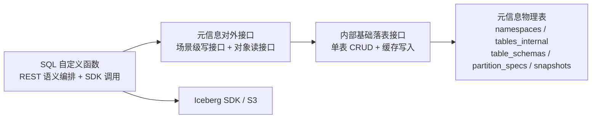
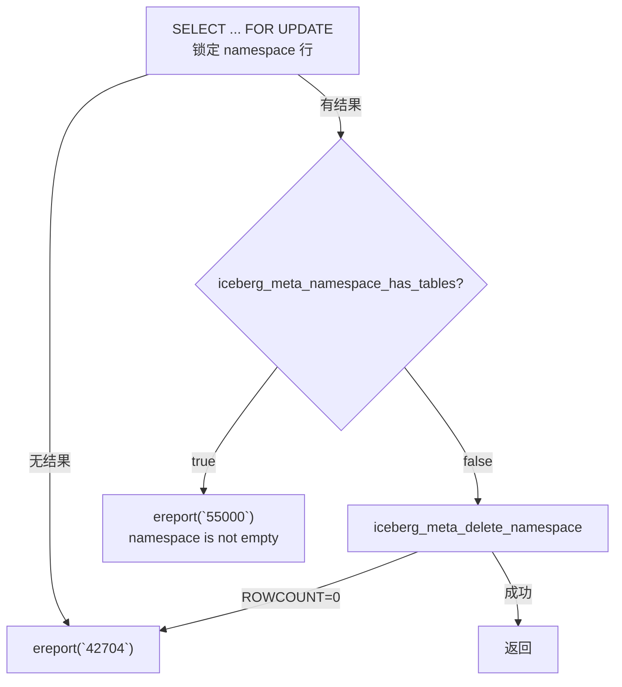
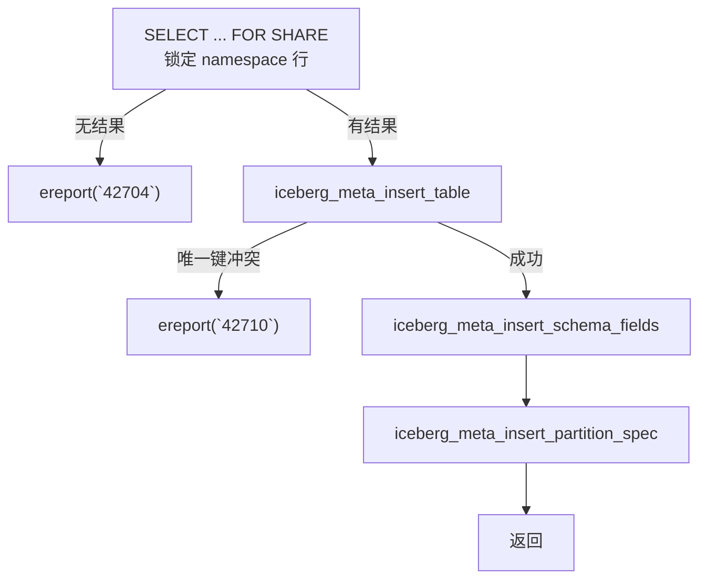
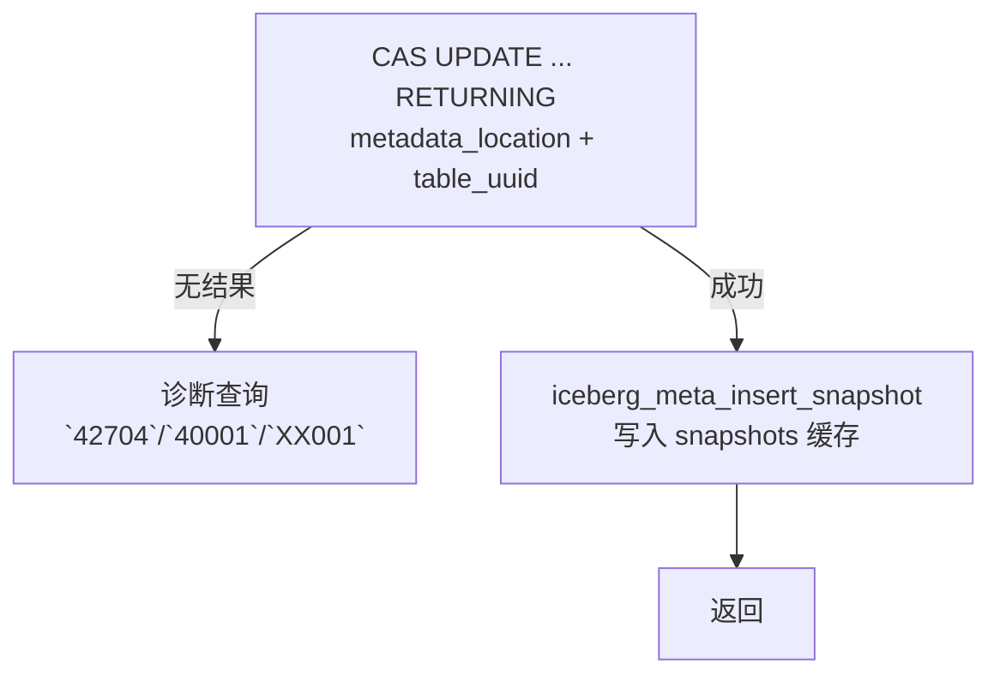
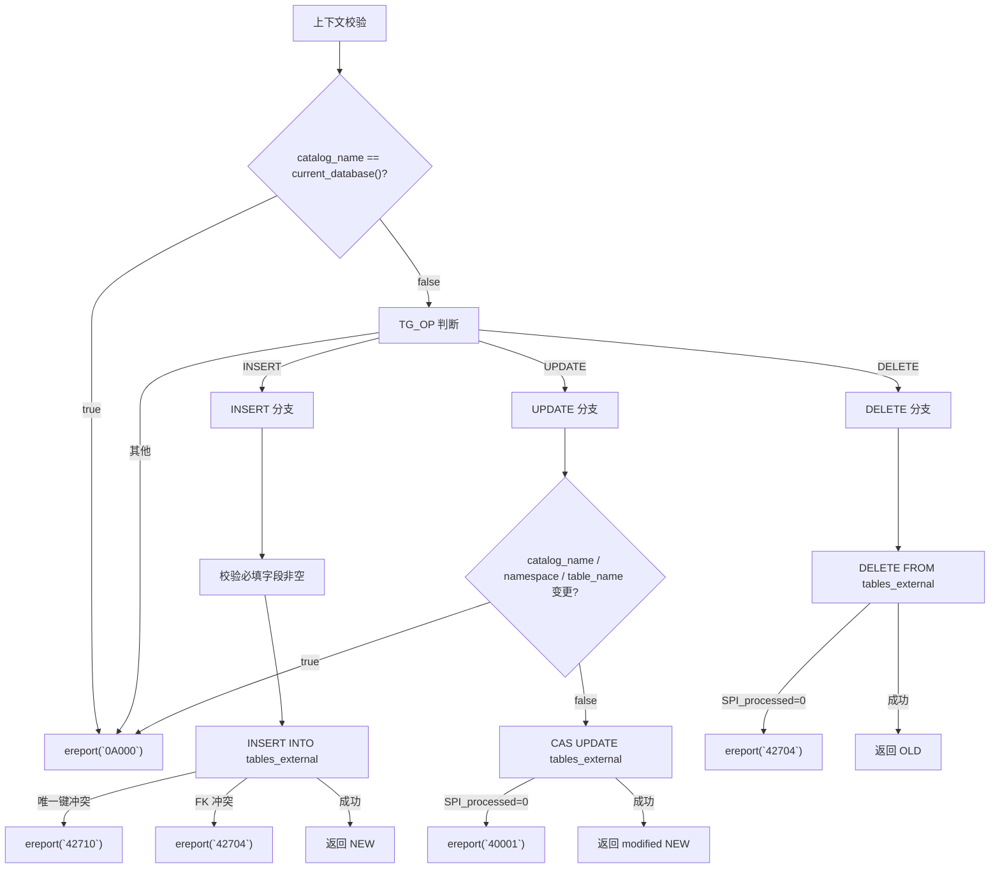

# openGauss Iceberg Catalog 元信息模块对外接口设计

> **执行摘要**：本文定义元信息模块的 `iceberg_meta_*` C/C++ 接口规范。模块采用三层架构——对外接口（场景级写 + 对象读）→ 内部基础落表 → 元信息物理表。写路径通过 `SELECT ... FOR UPDATE` 行锁串行化，`metadata_location` 乐观锁防指针过期，失败统一以 `ereport(ERROR)` 抛出 openGauss/PostgreSQL 标准 SQLSTATE。首期仅服务 internal catalog（`catalog_name = current_database()`），external 通过视图 + trigger 独立处理。

## 1. 架构与约束

### 1.1 模块定位

元信息模块位于 SQL 函数与元信息物理表之间。SQL 函数负责 REST 语义编排、Iceberg SDK 调用和对外错误码映射；元信息模块负责本地元信息表读写、表指针与缓存一致性、行锁与乐观锁管理、标准 SQLSTATE 归一化。



### 1.2 职责划分

| 负责 | 不负责 |
| --- | --- |
| 参数校验（空值、空串、JSON 形态） | 生成 table/metadata location |
| 提供 namespace/table 读写接口 | 解析完整 metadata.json |
| 多表一致性更新封装 | 写入或清理 S3 对象 |
| 行锁 + metadata_location 乐观锁 | 创建/删除 openGauss relation |
| 数据库约束错误 → 标准 SQLSTATE | 判断 REST API 业务流程 |
| 构造返回结构体/JSON，内存复制到当前 context | |

### 1.3 分层调用约定

1. SQL 函数只调用对外接口，不直接组合基础落表接口。
2. 多表一致性更新必须走场景级写接口。
3. 基础落表接口仅供模块内部使用。
4. 对外接口统一管理一次 SPI 生命周期：入口执行 `SPI_connect`，所有内部基础接口复用该 SPI 上下文，出口执行 `SPI_finish`。
5. 基础落表接口不自行 `SPI_connect` / `SPI_finish`，仅在已建立的 SPI 上下文中执行参数化 SQL。
6. 所有操作在调用方事务中执行，模块不自行提交或回滚。
7. 失败通过 `ereport(ERROR)` 抛出 SQLSTATE。
---

## 2. 关键数据结构

### 2.1 MetaNamespaceInfo

```cpp
typedef struct MetaNamespaceInfo {
    char *namespace_name;    // Namespace 名称。
    char *properties_json;   // namespaces.properties 的 JSON 字符串。
} MetaNamespaceInfo;
```

### 2.2 MetaTableInfo

```cpp
typedef struct MetaTableInfo {
    Oid relid;                             // internal 表绑定的 openGauss relation OID。
    char *namespace_name;                  // 表所属 namespace。
    char *table_name;                      // 表名。
    char *table_uuid;                      // Iceberg table UUID 字符串，对外接口使用字符串，写表时通过 $n::uuid 转换。
    char *metadata_location;               // 当前 metadata.json 指针。
    char *previous_metadata_location;      // 上一个 metadata.json 指针，可为 NULL。
    char *table_location;                  // Iceberg 表根路径，由 SDK 生成。
    int last_column_id;                    // 当前最大字段 ID。
    int current_schema_id;                 // 当前 schema ID。
    bool has_current_schema_id;            // current_schema_id 是否为 SQL 非空。
    int64_t current_snapshot_id;           // 当前 snapshot ID。
    bool has_current_snapshot_id;          // current_snapshot_id 是否为 SQL 非空。
    int default_spec_id;                   // 默认 partition spec ID。
    bool has_default_spec_id;              // default_spec_id 是否为 SQL 非空。
} MetaTableInfo;
```

**结构约定**：

- UUID 对外使用字符串，写表时通过 `$n::uuid` 转换。
- 可空数值字段使用 `has_*` 标记区分 SQL NULL 与真实值。
- 字符串返回前必须复制到当前 memory context，不可引用查询结果临时内存。

### 2.3 has_* 标记使用约定

| 上下文 | 约定 |
| --- | --- |
| 返回结构（MetaTableInfo） | `has_*` 表达对应数据库列是否为 SQL NULL |
| 基础接口 `iceberg_meta_update_table` | 保留 `has_new_*` 参数，区分"不更新该列"和"更新为某个值" |
| 场景级接口 | 一定更新的字段直接传值，不暴露 `has_*`；只有业务允许缺省时才保留（如 snapshot 的 `schema_id`、`total_records`） |
| SQL 函数层 | 不直接调用 `iceberg_meta_update_table`，只组装场景级输入 |

### 2.4 场景级输入结构

**(1) MetaRegisterTableInput**

```cpp
typedef struct MetaRegisterTableInput {
    MetaTableInfo table_info;             // 待注册表的主记录信息，来自 SDK 和 DDL 模块。
    const char *schema_json;              // 当前 schema JSON，用于展开写入 table_schemas。
    const char *partition_fields_json;    // partition-spec fields JSON 数组；无分区时可为 NULL 或空数组。
    int schema_id;                        // 当前 schema ID。
    int spec_id;                          // 当前 partition spec ID。
} MetaRegisterTableInput;
```

**(2) MetaCommitTableInput**

```cpp
typedef struct MetaCommitTableInput {
    const char *namespace_name;           // 表所属 namespace。
    const char *table_name;               // 表名。
    const char *table_uuid;               // Iceberg table UUID，来自 iceberg_meta_lock_table 返回值。
    const char *old_metadata_location;    // 提交前 metadata_location，用作乐观锁条件。
    const char *new_metadata_location;    // SDK commit 后生成的新 metadata_location。
    int64_t new_snapshot_id;              // 本次提交产生的新 snapshot ID。
    int snapshot_schema_id;               // snapshot 关联的 schema ID。
    bool has_snapshot_schema_id;          // snapshot_schema_id 是否写入 snapshots.schema_id。
    int64_t snapshot_timestamp_ms;        // snapshot timestamp-ms。
    const char *manifest_list;            // snapshot manifest-list 路径，可为 NULL。
    int64_t total_records;                // summary.total-records。
    bool has_total_records;               // total_records 是否写入 snapshots.total_records。
} MetaCommitTableInput;
```

**(3) MetaCommitSchemaChangeInput**

```cpp
typedef struct MetaCommitSchemaChangeInput {
    const char *namespace_name;           // 表所属 namespace。
    const char *table_name;               // 表名。
    const char *table_uuid;               // Iceberg table UUID，来自 iceberg_meta_lock_table 返回值。
    const char *old_metadata_location;    // 变更前 metadata_location，用作乐观锁条件。
    const char *new_metadata_location;    // SDK schema commit 后生成的新 metadata_location。
    int new_schema_id;                    // 新 schema ID，同时写入 tables_internal.current_schema_id。
    const char *schema_json;              // 新 schema JSON，用于展开写入 table_schemas。
    int new_last_column_id;               // 新 last-column-id，写入 tables_internal.last_column_id。
} MetaCommitSchemaChangeInput;
```

**(4) MetaCommitPartitionSpecChangeInput**

```cpp
typedef struct MetaCommitPartitionSpecChangeInput {
    const char *namespace_name;           // 表所属 namespace。
    const char *table_name;               // 表名。
    const char *table_uuid;               // Iceberg table UUID，来自 iceberg_meta_lock_table 返回值。
    const char *old_metadata_location;    // 变更前 metadata_location，用作乐观锁条件。
    const char *new_metadata_location;    // SDK partition spec commit 后生成的新 metadata_location。
    int new_default_spec_id;              // 新默认 partition spec ID，写入 tables_internal.default_spec_id。
    const char *partition_fields_json;    // 新 spec 的 fields JSON 数组；无分区时可为 NULL 或空数组。
} MetaCommitPartitionSpecChangeInput;
```

以上结构体仅保存 SDK/DDL 已生成的结果，元信息模块不负责生成路径或解析完整 `metadata.json`。

---

## 3. 对外接口总览

### 3.1 场景级写接口

多表一致性更新必须通过以下接口完成，调用方不得直接组合基础落表接口。

| 函数签名 | 功能描述 | 主要错误码 |
| --- | --- | --- |
| `void iceberg_meta_create_namespace(const char *namespace_name, const char *properties_json)` | 创建 namespace 目录记录；`properties_json` 为 NULL 时按 `{}` 处理 | `22023` 参数/JSON 非法；`42710` 已存在 |
| `void iceberg_meta_register_table(const char *namespace_name, const char *table_name, const MetaRegisterTableInput *input)` | CREATE TABLE 后注册 internal 表，原子写入主表与结构缓存 | `22023` 入参非法；`42704` namespace 不存在；`42710` 表名/UUID/relid 冲突 |
| `MetaTableInfo* iceberg_meta_lock_table(const char *namespace_name, const char *table_name)` | 写路径提交前读取并锁定表记录 | `22023` 入参非法；`42704` 表不存在 |
| `void iceberg_meta_commit_table(const MetaCommitTableInput *input)` | 数据提交后更新 table 指针并写入 snapshot 缓存 | `22023` 入参非法；`40001` 乐观锁冲突；`XX001` table_uuid 不一致 |
| `void iceberg_meta_commit_schema_change(const MetaCommitSchemaChangeInput *input)` | Schema 变更后更新 schema 指针并写入 schema 缓存 | `22023` 入参非法；`40001` 乐观锁冲突；`XX001` table_uuid 不一致 |
| `void iceberg_meta_commit_partition_spec_change(const MetaCommitPartitionSpecChangeInput *input)` | Partition spec 演进后更新 spec 指针并写入 partition spec 缓存 | `22023` 入参非法；`40001` 乐观锁冲突；`XX001` table_uuid 不一致 |
| `void iceberg_meta_drop_namespace(const char *namespace_name)` | 删除空 namespace | `22023` 入参非法；`42704` 不存在；`55000` 非空 |
| `void iceberg_meta_drop_table_record(const char *namespace_name, const char *table_name)` | DDL 删除 relation 后删除 internal 表记录 | `22023` 入参非法；`42704` 表不存在 |
| `void iceberg_meta_rename_table_record(const char *src_namespace, const char *src_table, const char *dst_namespace, const char *dst_table)` | Rename table 后更新目录记录；支持跨 namespace rename | `22023` 入参非法；`42704` 源表/目标 namespace 不存在；`42710` 目标表已存在 |
| `char* iceberg_meta_update_namespace_properties(const char *namespace_name, const char *removals_json, const char *updates_json)` | 原子更新 namespace properties；返回 `UpdateNamespacePropertiesResponse` JSON | `22023` 入参/JSON 非法或同键删除+更新；`42704` namespace 不存在 |

### 3.2 对象读接口

只涉及查询、存在性检查和列表操作，不修改元信息表。

| 函数签名 | 功能描述 | 主要错误码 |
| --- | --- | --- |
| `bool iceberg_meta_namespace_exists(const char *namespace_name)` | 判断 namespace 是否存在；不存在返回 false | `22023` 入参非法 |
| `MetaNamespaceInfo* iceberg_meta_get_namespace(const char *namespace_name)` | 读取 namespace properties；不存在返回 NULL；使用后调用 `iceberg_meta_free_namespace_info` 释放 | `22023` 入参非法 |
| `char* iceberg_meta_list_namespaces(const char *parent, int page_size, const char *page_token)` | 分页列出 namespace，返回 ListNamespacesResponse JSON；`parent` 为 NULL/空串时列出顶层 | `22023` 分页参数非法；`42704` parent 不存在 |
| `bool iceberg_meta_table_exists(const char *namespace_name, const char *table_name)` | 判断 internal 表是否存在；不存在返回 false | `22023` 入参非法 |
| `MetaTableInfo* iceberg_meta_get_table(const char *namespace_name, const char *table_name)` | 读取 internal 表元信息；不存在返回 NULL；使用后调用 `iceberg_meta_free_table_info` 释放 | `22023` 入参非法 |
| `char* iceberg_meta_list_tables(const char *namespace_name, int page_size, const char *page_token)` | 分页列出 namespace 下 internal 表，返回 ListTablesResponse JSON | `22023` 分页参数非法；`42704` namespace 不存在 |

### 3.3 内存释放接口

| 函数签名 | 说明 |
| --- | --- |
| `void iceberg_meta_free_namespace_info(MetaNamespaceInfo *info)` | 释放 `iceberg_meta_get_namespace` 返回的对象；info 可为 NULL |
| `void iceberg_meta_free_table_info(MetaTableInfo *info)` | 释放 `iceberg_meta_get_table` / `iceberg_meta_lock_table` 返回的对象；info 可为 NULL |

返回对象分配在调用方当前 memory context。释放接口可实现为真实释放，也可在统一 memory context 策略下实现为空操作，调用方不应依赖具体分配策略。

---

## 4. SQL 函数到接口的映射

| SQL 函数 | 接口调用链 | 说明 |
| --- | --- | --- |
| `create_namespace` | `iceberg_meta_create_namespace` | 创建 namespace 目录记录 |
| `list_namespaces` | `iceberg_meta_list_namespaces` | 分页返回 namespace 列表 JSON |
| `load_namespace` | `iceberg_meta_get_namespace` | 不存在时返回 NULL，SQL 函数自行转错误 |
| `drop_namespace` | `iceberg_meta_drop_namespace` | 删除空 namespace |
| `is_namespace_existed` | `iceberg_meta_namespace_exists` | 返回 bool，不抛 `42704` |
| `update_namespace_properties` | `iceberg_meta_update_namespace_properties` | 原子更新，返回 updated/removed/missing |
| `create_table` | `iceberg_meta_register_table` | SDK 创建 metadata、DDL 创建 relation 后注册 |
| `load_table` | `iceberg_meta_get_table` | 读取 metadata 指针与表摘要 |
| `list_tables` | `iceberg_meta_list_tables` | 分页返回 internal 表列表 JSON |
| `drop_table` | `iceberg_meta_lock_table` → DDL 删除 relation → `iceberg_meta_drop_table_record` | 删除前锁定表记录 |
| `commit_table` | `iceberg_meta_lock_table` → SDK commit → `iceberg_meta_commit_table` | 数据提交收尾 |
| `add_column` | `iceberg_meta_lock_table` → SDK commit → `iceberg_meta_commit_schema_change` | Schema 变更收尾 |
| `rename_table` | `iceberg_meta_rename_table_record` | 更新目录记录 |
| `is_table_existed` | `iceberg_meta_table_exists` | 返回 bool，不抛 `42704` |
| Partition spec 演进 | `iceberg_meta_lock_table` → SDK commit → `iceberg_meta_commit_partition_spec_change` | Partition spec 变更收尾 |

### 4.1 调用规则

1. SQL 函数不得直接调用或组合第 7 章内部基础落表接口；典型包括 `iceberg_meta_insert_table`、`iceberg_meta_update_table`、`iceberg_meta_delete_table`、`iceberg_meta_insert_snapshot`、`iceberg_meta_insert_schema_fields`、`iceberg_meta_insert_partition_spec`。
2. 写路径（commit_table / add_column / partition spec 演进）必须先调用 `iceberg_meta_lock_table`，使用返回的 `metadata_location` 和 `table_uuid` 调用 SDK。
3. SDK 成功后必须调用对应场景级提交接口，保证 table 指针和缓存表在同一事务内更新。
4. `iceberg_meta_register_table` 必须在 SDK metadata 和 openGauss relation 均创建完成后调用。
5. `iceberg_meta_drop_table_record` 必须在 DDL 删除 relation 成功后调用。

---

## 5. 场景级写接口实现

场景级写接口封装多张元信息表的一致性更新。每个接口按"入参约束 → 实现"两层组织：入参约束以表格列出校验项及违规时的错误码；实现仅描述业务逻辑。

本章按功能域分为五组：**Namespace 生命周期**、**Table 注册与锁定**、**Table 提交**、**Table 删除与重命名**、**Namespace 属性更新**。

### 5.1 Namespace 生命周期

#### 5.1.1 iceberg_meta_create_namespace

```cpp
void iceberg_meta_create_namespace(const char *namespace_name,
                                  const char *properties_json);
```

创建 namespace 目录记录。`properties_json` 为 NULL 时默认写入 `"{}"`。

**入参约束**：

| 参数 | 约束 | 违规 |
| --- | --- | --- |
| `namespace_name` | 非 NULL 且非空串 | `22023` |
| `properties_json` | NULL 视为 `"{}"`；非 NULL 时须为合法 JSON object | `22023` |

**实现**：

1. 调用 `iceberg_meta_insert_namespace(namespace_name, properties_json)` 执行 INSERT。若发生唯一键冲突（DUPLICATE_KEY），说明同名 namespace 已存在，ereport(`42710`, "namespace already exists")。

#### 5.1.2 iceberg_meta_drop_namespace

```cpp
void iceberg_meta_drop_namespace(const char *namespace_name);
```

删除空 namespace。FOR UPDATE 行锁阻止并发注册，因此锁内一次非空检查即可保证安全。

**入参约束**：`namespace_name` 须非 NULL 且非空串，否则 `22023`。



**实现**：

1. **行锁与存在性校验。** 执行 `SELECT ... FOR UPDATE` 锁定 namespace 行。若查询无结果，说明 namespace 不存在，ereport(`42704`)。
2. **非空检查。** 调用 `iceberg_meta_namespace_has_tables(namespace_name)` 检查 namespace 下是否仍有表。若返回 true，ereport(`55000`, "namespace is not empty")。FOR UPDATE 已阻止并发 `register_table`（其 FOR SHARE 与 FOR UPDATE 冲突），因此锁内一次检查即可。
3. **删除 namespace 记录。** 调用内部基础接口 `iceberg_meta_delete_namespace(namespace_name)` 执行 DELETE。若 ROWCOUNT 为 0，说明 namespace 不存在，ereport(`42704`)。

### 5.2 Table 注册与锁定

#### 5.2.1 iceberg_meta_register_table

```cpp
void iceberg_meta_register_table(const char *namespace_name,
                                const char *table_name,
                                const MetaRegisterTableInput *input);
```

CREATE TABLE 的收尾接口：在 SDK 生成 metadata 文件且 DDL 创建 openGauss relation 之后，原子写入 `tables_internal` 主记录、`table_schemas` 和 `partition_specs` 缓存。

**入参约束**：

| 参数 | 约束 | 违规 |
| --- | --- | --- |
| `namespace_name`、`table_name` | 均非 NULL 且非空串 | `22023` |
| `input` | 非 NULL | `22023` |
| `input.table_info.table_uuid`、`input.table_info.metadata_location`、`input.table_info.table_location` | 均非 NULL 且非空串 | `22023` |
| `input.table_info.previous_metadata_location` | 必须为 NULL（注册不应有历史指针） | `22023` |
| `input.schema_json` | 非 NULL 且为合法 Iceberg schema JSON，`fields` 为非空数组 | `22023` |
| `input.partition_fields_json` | NULL 或空串视为 `[]`；非空时须为合法 JSON 数组 | `22023` |
| `input.schema_id`、`input.spec_id` | 均 ≥ 0 | `22023` |
| `input.table_info.current_schema_id` | `has_current_schema_id=true`，且值等于 `input.schema_id` | `22023` |
| `input.table_info.default_spec_id` | `has_default_spec_id=true`，且值等于 `input.spec_id` | `22023` |
| `input.table_info.relid` | 有效 OID（非 InvalidOid） | `22023` |
| `input.table_info.last_column_id` | ≥ 0 | `22023` |



**实现**：

1. **锁定 namespace。** 执行 `SELECT ... FOR SHARE` 锁定 namespace 行。FOR SHARE 允许并发读取但阻止并发删除。若查询无结果，ereport(`42704`, "namespace not found")。
2. **写入主表记录。** 调用 `iceberg_meta_insert_table(namespace_name, table_name, &input.table_info)` 写入 `tables_internal`。若发生唯一键冲突（DUPLICATE_KEY），说明同名表、同 UUID 或同 relid 已存在，ereport(`42710`)。
3. **写入 Schema 缓存。** 调用 `iceberg_meta_insert_schema_fields(input.table_info.table_uuid, input.schema_id, input.schema_json)` 展开写入 `table_schemas`。
4. **写入 Partition Spec 缓存。** 调用 `iceberg_meta_insert_partition_spec(input.table_info.table_uuid, input.spec_id, input.partition_fields_json)` 写入 `partition_specs`。若 `partition_fields_json` 为 NULL 或空数组，则写入占位记录。

#### 5.2.2 iceberg_meta_lock_table

```cpp
MetaTableInfo* iceberg_meta_lock_table(const char *namespace_name,
                                      const char *table_name);
```

写路径的前置步骤：读取并锁定表记录，返回 `MetaTableInfo*` 供调用方获取 `metadata_location` 和 `table_uuid`。行锁保持到当前事务结束。

**入参约束**：`namespace_name`、`table_name` 均须非 NULL 且非空串，否则 `22023`。

**实现**：

1. **加锁读取。** 调用 `iceberg_meta_get_table_for_update(namespace_name, table_name)` 执行 `SELECT ... FOR UPDATE`。若返回 NULL，说明表不存在，ereport(`42704`, "table not found")。
2. **构造返回结构。** 从查询结果构造 `MetaTableInfo`：设置 `has_*` 标记，字符串字段复制到当前 memory context。返回指针，行锁在事务结束时自动释放。调用方使用完毕后须调用 `iceberg_meta_free_table_info` 释放。

### 5.3 Table 提交

三类提交接口共享相同的 **UUID 一致性校验 + 乐观锁更新 + 缓存写入** 骨架。为减少同一 SPI 生命周期内的重复 SQL 执行，提交接口应将 UUID 校验与主表 CAS 更新合并为一条 `UPDATE ... RETURNING`。缓存表写入仍保留独立内部接口，避免把 JSON 展开、多行插入和错误码转换塞入一条复杂 SQL。

**通用主表更新逻辑（由 `iceberg_meta_update_table` 实现）**：

```sql
UPDATE tables_internal
SET previous_metadata_location = metadata_location,
    metadata_location = $new_metadata_location,
    current_snapshot_id = CASE WHEN $has_new_snapshot_id THEN $new_snapshot_id ELSE current_snapshot_id END,
    current_schema_id   = CASE WHEN $has_new_schema_id THEN $new_schema_id ELSE current_schema_id END,
    last_column_id      = CASE WHEN $has_new_last_column_id THEN $new_last_column_id ELSE last_column_id END,
    default_spec_id     = CASE WHEN $has_new_default_spec_id THEN $new_default_spec_id ELSE default_spec_id END
WHERE namespace = $namespace
  AND table_name = $table_name
  AND metadata_location = $old_metadata_location
  AND table_uuid = $table_uuid::uuid
RETURNING table_uuid::text
```

`UPDATE` 本身会锁定被更新行，不再额外执行 `SELECT ... FOR UPDATE`。若 `RETURNING` 无结果，提交接口再执行诊断查询区分错误：表不存在则 `42704`；`metadata_location` 不匹配则 `40001`；`metadata_location` 匹配但 `table_uuid` 不匹配则 `XX001`。

#### 5.3.1 iceberg_meta_commit_table

```cpp
void iceberg_meta_commit_table(const MetaCommitTableInput *input);
```

数据提交（INSERT/UPDATE/DELETE 产生新 snapshot）的收尾接口：更新 `tables_internal` 的 `metadata_location` 和 `current_snapshot_id`，并写入 `snapshots` 缓存。

**入参约束**：`input` 非 NULL；`input` 内的 `namespace_name`、`table_name`、`table_uuid`、`old_metadata_location`、`new_metadata_location` 均须非 NULL 且非空串；`new_snapshot_id`、`snapshot_timestamp_ms` 均须 ≥ 0；当 `has_snapshot_schema_id=true` 时 `snapshot_schema_id` 须 ≥ 0；当 `has_total_records=true` 时 `total_records` 须 ≥ 0。违规均 ereport(`22023`)。



**实现**：

1. **更新表指针并校验 UUID。** 调用内部基础接口 `iceberg_meta_update_table`，参数设置为：`has_new_snapshot_id=true`，`new_snapshot_id` 为本次提交产生的 snapshot ID；其余 `has_new_*` 全部为 false。
2. **写入 Snapshot 缓存。** 调用 `iceberg_meta_insert_snapshot`，将 `table_uuid`、`new_snapshot_id`、`snapshot_schema_id`（由 `has_snapshot_schema_id` 控制）、`snapshot_timestamp_ms`、`manifest_list`、`total_records`（由 `has_total_records` 控制）写入 `snapshots` 表。

#### 5.3.2 iceberg_meta_commit_schema_change

```cpp
void iceberg_meta_commit_schema_change(const MetaCommitSchemaChangeInput *input);
```

Schema 变更（ADD/DROP COLUMN 等产生新 schema 版本）的收尾接口：更新 `metadata_location`、`current_schema_id` 和 `last_column_id`，并写入新的 `table_schemas` 记录。

**入参约束**：`input` 非 NULL；`input` 内的 `namespace_name`、`table_name`、`table_uuid`、`old_metadata_location`、`new_metadata_location`、`schema_json` 均须非 NULL 且非空串；`schema_json` 须为合法 Iceberg schema JSON；`new_schema_id`、`new_last_column_id` 均须 ≥ 0。违规均 ereport(`22023`)。

**实现**：

1. **更新表指针并校验 UUID。** 调用内部基础接口 `iceberg_meta_update_table`，参数设置为：`has_new_schema_id=true`，`new_schema_id` 为新 schema ID；`has_new_last_column_id=true`，`new_last_column_id` 为新最大列 ID；其余 `has_new_*` 为 false。
2. **写入 Schema 缓存。** 调用 `iceberg_meta_insert_schema_fields(table_uuid, new_schema_id, schema_json)` 展开新 schema 的全部字段。

#### 5.3.3 iceberg_meta_commit_partition_spec_change

```cpp
void iceberg_meta_commit_partition_spec_change(const MetaCommitPartitionSpecChangeInput *input);
```

Partition spec 演进的收尾接口：更新 `metadata_location` 和 `default_spec_id`，并写入新的 `partition_specs` 记录。

**入参约束**：`input` 非 NULL；`input` 内的 `namespace_name`、`table_name`、`table_uuid`、`old_metadata_location`、`new_metadata_location` 均须非 NULL 且非空串；`new_default_spec_id` 须 ≥ 0；`partition_fields_json` 为 NULL 或空串时视为 `[]`，非空时须为合法 JSON 数组。违规均 ereport(`22023`)。

**实现**：

1. **更新表指针并校验 UUID。** 调用内部基础接口 `iceberg_meta_update_table`，参数设置为：`has_new_default_spec_id=true`，`new_default_spec_id` 为新默认 spec ID；其余 `has_new_*` 为 false。
2. **写入 Partition Spec 缓存。** 调用 `iceberg_meta_insert_partition_spec(table_uuid, new_default_spec_id, partition_fields_json)`。若 `partition_fields_json` 为 NULL 或空数组，写入占位记录。

### 5.4 Table 删除与重命名

#### 5.4.1 iceberg_meta_drop_table_record

```cpp
void iceberg_meta_drop_table_record(const char *namespace_name,
                                  const char *table_name);
```

DDL 删除 openGauss relation 之后调用，删除 internal 表在 `tables_internal` 中的目录记录。

**入参约束**：`namespace_name`、`table_name` 均须非 NULL 且非空串，否则 `22023`。

**实现**：

1. 调用 `iceberg_meta_delete_table(namespace_name, table_name)` 执行 DELETE。若 ROWCOUNT 为 0，说明表不存在，ereport(`42704`)。缓存表由 ON DELETE CASCADE 自动清理。

#### 5.4.2 iceberg_meta_rename_table_record

```cpp
void iceberg_meta_rename_table_record(const char *src_namespace,
                                    const char *src_table,
                                    const char *dst_namespace,
                                    const char *dst_table);
```

Rename table 后更新目录记录，支持跨 namespace 重命名。委托 `iceberg_meta_rename_table` 完成实际的锁与更新。

**入参约束**：四个参数均须非 NULL 且非空串，否则 `22023`。

**实现**：

调用 `iceberg_meta_rename_table(src_namespace, src_table, dst_namespace, dst_table)`，该函数内部依次执行：

1. **锁定目标 namespace**：对 `dst_namespace` 执行 `SELECT ... FOR SHARE`，防止 rename 期间目标 namespace 被并发删除。若不存在，ereport(`42704`)。
2. **锁定源表**：调用 `iceberg_meta_get_table_for_update(src_namespace, src_table)` 加行锁。若不存在，ereport(`42704`)。
3. **检查目标冲突**：调用 `iceberg_meta_table_exists(dst_namespace, dst_table)`。若目标已存在同名表，ereport(`42710`)。
4. **执行更新**：`UPDATE tables_internal SET namespace=?, table_name=? WHERE namespace=? AND table_name=?`。唯一键冲突则 `42710`，ROWCOUNT=0 则 `42704`。

### 5.5 Namespace 属性更新

#### 5.5.1 iceberg_meta_update_namespace_properties

```cpp
char* iceberg_meta_update_namespace_properties(const char *namespace_name,
                                             const char *removals_json,
                                             const char *updates_json);
```

原子更新 namespace 的 properties：读取当前 properties，删除 `removals` 中列出的 key，合并 `updates` 中的 key/value，回写并返回变更摘要 JSON。

**入参约束**：

| 参数 | 约束 | 违规 |
| --- | --- | --- |
| `namespace_name` | 非 NULL 且非空串 | `22023` |
| `removals_json` | NULL 视为 `[]`；非 NULL 须为合法字符串数组 JSON | `22023` |
| `updates_json` | NULL 视为 `{}`；非 NULL 须为合法 JSON object | `22023` |
| `removals` ∪ `updates` | 不同时为空 | `22023` |
| `removals` ∩ `updates` | 无相同 key | `22023` |

**实现**：

1. **加锁读取当前 properties。** 执行 `SELECT properties::text FROM namespaces WHERE catalog_name=current_database() AND namespace=? FOR UPDATE` 锁定并读取。若无记录，ereport(`42704`)。
2. **执行内存级变更。** 对 `removals` 中每个 key：若存在于 properties，删除并记入 `removed` 数组；否则记入 `missing` 数组。对 `updates` 中每个 key/value：更新 properties，记入 `updated` 数组。
3. **回写。** 执行 `UPDATE namespaces SET properties=?::jsonb WHERE catalog_name=current_database() AND namespace=?`。ROWCOUNT 为 0 则 ereport(`42704`)（防御性检查）。
4. **返回。** 构造并返回 `{"updated": [...], "removed": [...], "missing": [...]}` JSON 字符串，由 SQL 函数层统一转为 JSONB。

---

## 6. 对象读接口实现

读接口只涉及查询，不修改元信息表。本章按查询模式分为三组：存在性检查、对象读取、分页列表。

### 6.1 存在性检查

```cpp
bool iceberg_meta_namespace_exists(const char *namespace_name);
bool iceberg_meta_table_exists(const char *namespace_name, const char *table_name);
```

两个函数遵循相同模式：查询 `SELECT 1 ... LIMIT 1`，有结果返回 `true`，无结果返回 `false`（不抛 `42704`）。

| 函数 | 入参约束 | 查询 SQL |
| --- | --- | --- |
| `namespace_exists` | `namespace_name` 非 NULL 且非空串，否则 `22023` | `SELECT 1 FROM namespaces WHERE catalog_name=current_database() AND namespace=? LIMIT 1` |
| `table_exists` | `namespace_name`、`table_name` 均非 NULL 且非空串，否则 `22023` | `SELECT 1 FROM tables_internal WHERE namespace=? AND table_name=? LIMIT 1` |

### 6.2 对象读取

```cpp
MetaNamespaceInfo* iceberg_meta_get_namespace(const char *namespace_name);
MetaTableInfo* iceberg_meta_get_table(const char *namespace_name, const char *table_name);
```

两个函数遵循相同模式：SELECT 全量字段，无结果返回 NULL，有结果则构造结构体并复制字符串到当前 memory context。

| 函数 | 入参约束 | 查询 SQL | 返回结构 |
| --- | --- | --- | --- |
| `get_namespace` | `namespace_name` 非 NULL 且非空串，否则 `22023` | `SELECT namespace, properties::text FROM namespaces WHERE catalog_name=current_database() AND namespace=?` | `MetaNamespaceInfo` |
| `get_table` | `namespace_name`、`table_name` 均非 NULL 且非空串，否则 `22023` | `SELECT 全列 FROM tables_internal WHERE namespace=? AND table_name=?` | `MetaTableInfo`（含 `has_*` 标记） |

调用方使用完毕后须分别调用 `iceberg_meta_free_namespace_info` 或 `iceberg_meta_free_table_info` 释放。返回的字符串字段已复制到当前 memory context，不引用查询结果临时内存。

### 6.3 分页列表

```cpp
char* iceberg_meta_list_namespaces(const char *parent,
                                  int page_size,
                                  const char *page_token);
char* iceberg_meta_list_tables(const char *namespace_name,
                              int page_size,
                              const char *page_token);
```

两个函数均采用 **last-key 游标分页**模型：按主键 ASC 排序，取 `page_size + 1` 条，前 `page_size` 条构成结果集，第 `page_size + 1` 条仅用于判断是否存在下一页。若存在下一页，`next-page-token` 编码为本页最后一条返回记录的排序键，避免下一页以 `>` 条件查询时跳过探测行。

#### 6.3.1 list_namespaces

**入参约束**：`page_size` 须 ≥ 1，否则 `22023`。`parent` 含 `/` 时首期不支持多级 namespace，`22023`。`page_token` 为 NULL 或空串时表示第一页；非空时必须能解码为当前接口支持的 token 结构，否则 `22023`。

**实现**：

1. **parent 处理。** NULL 或空串时列出顶层 namespace；合法单段时调用 `iceberg_meta_namespace_exists(parent)` 校验存在性，不存在则 `42704`，存在则返回空列表（首期无子级）。
2. **分页查询。** 解码 `page_token` 得到 `last_namespace`（NULL 视为空串），执行：

   ```sql
   SELECT namespace FROM namespaces
   WHERE catalog_name = current_database()
     AND (namespace > last_namespace)
   ORDER BY namespace ASC
   LIMIT page_size + 1
   ```

3. **构造结果。** 取前 `page_size` 条构造 `namespaces` 数组。若存在第 `page_size + 1` 条，以本页最后一条已返回的 namespace 值编码为 `next-page-token`。返回 `{"namespaces": [["db1"]], "next-page-token": "..."}` JSON 字符串。最后一页省略 `next-page-token` 或返回 `null`。

#### 6.3.2 list_tables

**入参约束**：`namespace_name` 非 NULL 且非空串，`page_size` ≥ 1，否则 `22023`。`namespace_name` 不存在则 `42704`。`page_token` 为 NULL 或空串时表示第一页；非空时必须能解码为当前接口支持的 token 结构，否则 `22023`。

**实现**：

1. **Namespace 存在性校验。** 调用 `iceberg_meta_namespace_exists(namespace_name)`，若返回 false 则 ereport(`42704`)。
2. **分页查询。** 解码 `page_token` 得到 `last_table`（NULL 视为空串），执行：

   ```sql
   SELECT table_name FROM tables_internal
   WHERE namespace = ?
     AND (table_name > last_table)
   ORDER BY table_name ASC
   LIMIT page_size + 1
   ```

3. **构造结果。** 取前 `page_size` 条，每条构造 `{"namespace": ["<ns>"], "name": "<table>"}` 加入 `identifiers` 数组。若存在第 `page_size + 1` 条，以本页最后一条已返回的 `table_name` 编码为 `next-page-token`。返回 `{"identifiers": [...], "next-page-token": "..."}` JSON 字符串。最后一页省略 `next-page-token`。

---

## 7. 内部基础落表接口实现

以下接口仅限元信息模块内部组合使用，不作为跨模块调用入口。按操作对象分为四组：Namespace 操作、Table 操作、缓存表写入、内存释放。内部接口同样采用"入参约束 + 实现"两层组织。

内部基础接口假定调用方已经处于有效 SPI 上下文中，不自行执行 `SPI_connect` / `SPI_finish`。SPI 生命周期由 `iceberg_meta_*` 对外入口统一包裹，以便场景级接口在一次 SPI 连接内组合多个基础落表动作。

实现中固定 SQL 文本优先定义为 `static const char *`；长 SQL 或多处复用的 SQL 应集中命名管理，短且单处使用的 SQL 可在函数内就地定义，不使用宏封装 SQL 字符串。

### 7.1 Namespace 内部操作

```cpp
void iceberg_meta_insert_namespace(const char *namespace_name,
                                  const char *properties_json);
void iceberg_meta_delete_namespace(const char *namespace_name);
bool iceberg_meta_namespace_has_tables(const char *namespace_name);
```

#### (1) iceberg_meta_insert_namespace

**入参约束**：

| 参数 | 约束 | 违规 |
| --- | --- | --- |
| `namespace_name` | 非 NULL 且非空串 | `22023` |
| `properties_json` | NULL 视为 `"{}"`；非 NULL 须为合法 JSON object | `22023` |

**实现**：

1. 执行 `INSERT INTO namespaces(catalog_name, namespace, properties) VALUES (current_database()::text, ?, ?::jsonb)`。唯一键冲突则 ereport(`42710`)。

#### (2) iceberg_meta_delete_namespace

**入参约束**：`namespace_name` 须非 NULL 且非空串，否则 `22023`。

**实现**：

1. 执行 `DELETE FROM namespaces WHERE catalog_name=current_database()::text AND namespace=?`，ROWCOUNT 为 0 则 ereport(`42704`)。调用方负责在调用前持有 namespace 行锁并完成非空检查。

#### (3) iceberg_meta_namespace_has_tables

**入参约束**：`namespace_name` 须非 NULL 且非空串，否则 `22023`。

**实现**：

1. 执行 `SELECT 1 FROM tables_internal WHERE namespace=? LIMIT 1`。有结果返回 `true`，无结果返回 `false`。

### 7.2 Table 内部操作

```cpp
MetaTableInfo* iceberg_meta_get_table_for_update(const char *namespace_name,
                                                  const char *table_name);
void iceberg_meta_insert_table(const char *namespace_name,
                               const char *table_name,
                               const MetaTableInfo *info);
void iceberg_meta_update_table(const char *namespace_name,
                               const char *table_name,
                               const char *table_uuid,
                               const char *old_metadata_location,
                               const char *new_metadata_location,
                               int64_t new_snapshot_id,  bool has_new_snapshot_id,
                               int new_schema_id,        bool has_new_schema_id,
                               int new_last_column_id,   bool has_new_last_column_id,
                               int new_default_spec_id,  bool has_new_default_spec_id);
void iceberg_meta_delete_table(const char *namespace_name,
                               const char *table_name);
void iceberg_meta_rename_table(const char *src_namespace,
                               const char *src_table,
                               const char *dst_namespace,
                               const char *dst_table);
```

#### (1) iceberg_meta_get_table_for_update

**入参约束**：`namespace_name`、`table_name` 均须非 NULL 且非空串，否则 `22023`。

**实现**：

1. 执行 `SELECT 全列 FROM tables_internal WHERE namespace=? AND table_name=? FOR UPDATE`。无结果返回 NULL；有结果则构造 `MetaTableInfo`（设置 `has_*` 标记，字符串复制到当前 memory context），行锁保持到事务结束。

#### (2) iceberg_meta_insert_table

**入参约束**：

| 参数 | 约束 | 违规 |
| --- | --- | --- |
| `namespace_name`、`table_name`、`info` | 均非 NULL | `22023` |
| `info.table_uuid`、`info.metadata_location`、`info.table_location` | 均非 NULL 且非空串 | `22023` |

**实现**：

1. 执行以下 INSERT，可空列根据对应 `has_*` 决定传值或 NULL：

   ```sql
   INSERT INTO tables_internal(
       relid, namespace, table_name, table_uuid,
       metadata_location, previous_metadata_location, table_location,
       last_column_id,
       current_schema_id, current_snapshot_id, default_spec_id
   ) VALUES (
       $1::regclass, $2, $3, $4::uuid,
       $5, $6, $7,
       $8,
       $9, $10, $11
   )
   ```

   唯一键冲突则 ereport(`42710`)。

#### (3) iceberg_meta_update_table

该接口仅供 `iceberg_meta_commit_table`、`iceberg_meta_commit_schema_change`、`iceberg_meta_commit_partition_spec_change` 三类场景级提交接口内部调用，用于更新 `metadata_location`、`previous_metadata_location` 以及对应的当前版本摘要字段。SQL 函数层不得直接调用。

`has_new_*` 参数区分两种意图：不更新（false）、更新为非 NULL 值（true + 有效值）。当前不能表达"更新为 SQL NULL"，若后续需要应扩展为 `Datum + isnull`。

**入参约束**：`namespace_name`、`table_name`、`table_uuid`、`old_metadata_location`、`new_metadata_location` 均须非 NULL 且非空串，否则 `22023`。

**实现**：

1. 执行带 UUID 校验的 CAS 乐观锁更新：

   ```sql
   UPDATE tables_internal
   SET previous_metadata_location = metadata_location,
       metadata_location = $new_metadata_location,
       current_snapshot_id = CASE WHEN $has_new_snapshot_id THEN $new_snapshot_id ELSE current_snapshot_id END,
       current_schema_id   = CASE WHEN $has_new_schema_id THEN $new_schema_id ELSE current_schema_id END,
       last_column_id      = CASE WHEN $has_new_last_column_id THEN $new_last_column_id ELSE last_column_id END,
       default_spec_id     = CASE WHEN $has_new_default_spec_id THEN $new_default_spec_id ELSE default_spec_id END
   WHERE namespace = $namespace
     AND table_name = $table_name
     AND table_uuid = $table_uuid::uuid
     AND metadata_location = $old_metadata_location
   RETURNING table_uuid::text
   ```

2. `RETURNING` 有结果则成功。无结果则执行诊断查询：表不存在为 `42704`；`metadata_location` 不匹配为 `40001`；`metadata_location` 匹配但 `table_uuid` 不匹配为 `XX001`。采用"先 UPDATE，失败后诊断"的顺序避免竞态；`SET previous_metadata_location = metadata_location` 自动保留旧指针。

#### (4) iceberg_meta_delete_table

**入参约束**：`namespace_name`、`table_name` 均须非 NULL 且非空串，否则 `22023`。

**实现**：

1. 执行 `DELETE FROM tables_internal WHERE namespace=? AND table_name=?`，ROWCOUNT 为 0 则 ereport(`42704`)。缓存表由外键 `ON DELETE CASCADE` 自动清理。

#### (5) iceberg_meta_rename_table

**入参约束**：四个参数均须非 NULL 且非空串，否则 `22023`。

**实现**：

1. `SELECT ... FOR SHARE` 锁定目标 namespace，不存在则 `42704`。
2. `iceberg_meta_get_table_for_update` 锁定源表，不存在则 `42704`。
3. `iceberg_meta_table_exists` 检查目标冲突，已存在则 `42710`。
4. `UPDATE tables_internal SET namespace=?, table_name=? WHERE namespace=? AND table_name=?`。唯一键冲突则 `42710`，ROWCOUNT=0 则 `42704`。

### 7.3 缓存表写入

```cpp
void iceberg_meta_insert_schema_fields(const char *table_uuid,
                                       int schema_id,
                                       const char *schema_json);
void iceberg_meta_insert_partition_spec(const char *table_uuid,
                                        int spec_id,
                                        const char *fields_json);
void iceberg_meta_insert_snapshot(const char *table_uuid,
                                  int64_t snapshot_id,
                                  int schema_id, bool has_schema_id,
                                  int64_t timestamp_ms,
                                  const char *manifest_list,
                                  int64_t total_records, bool has_total_records);
```

#### (1) iceberg_meta_insert_schema_fields

将 Iceberg schema JSON 的 `fields` 数组展开为 `table_schemas` 行。嵌套类型整体序列化，不递归拆行。

**入参约束**：

| 参数 | 约束 | 违规 |
| --- | --- | --- |
| `table_uuid` | 非 NULL 且非空串 | `22023` |
| `schema_id` | ≥ 0 | `22023` |
| `schema_json` | 非 NULL 且非空串，须为合法 Iceberg schema JSON 且 `fields` 为非空数组 | `22023` |

**实现**：

1. 按数组下标顺序（`field_position` 从 0 开始）遍历每个 field，校验必填字段 `id`、`name`、`required`、`type`，缺失则 `22023`。逐行执行：

   ```sql
   INSERT INTO table_schemas(
       table_uuid, schema_id, field_position,
       field_id, field_name, field_required,
       field_type, field_doc
   ) VALUES ($1::uuid, $2, $3, $4, $5, $6, $7, $8)
   ```

   唯一键冲突则 ereport(`42710`)。

#### (2) iceberg_meta_insert_partition_spec

将 partition spec 的 fields 数组展开为 `partition_specs` 行。无分区时写入占位记录（`field_position=-1`，其余 NULL）。

**入参约束**：

| 参数 | 约束 | 违规 |
| --- | --- | --- |
| `table_uuid` | 非 NULL 且非空串 | `22023` |
| `spec_id` | ≥ 0 | `22023` |
| `fields_json` | NULL 或空串视为 `[]`；非空时须为合法 JSON 数组 | `22023` |

**实现**：

1. 空 fields 时写入占位记录。非空时按数组下标遍历，校验必填字段 `field-id`、`source-id`、`name`、`transform`，缺失则 `22023`。`transform` 为字符串时直接保存，为 JSON object 时转紧凑字符串。逐行执行：

   ```sql
   INSERT INTO partition_specs(
       table_uuid, spec_id, field_position,
       field_id, source_id, field_name, transform
   ) VALUES ($1::uuid, $2, $3, $4, $5, $6, $7)
   ```

   唯一键冲突则 ereport(`42710`)。

#### (3) iceberg_meta_insert_snapshot

**入参约束**：

| 参数 | 约束 | 违规 |
| --- | --- | --- |
| `table_uuid` | 非 NULL 且非空串 | `22023` |
| `snapshot_id`、`timestamp_ms` | 均 ≥ 0 | `22023` |
| `schema_id` | `has_schema_id=true` 时须 ≥ 0 | `22023` |
| `total_records` | `has_total_records=true` 时须 ≥ 0 | `22023` |

**实现**：

1. 执行以下 INSERT，`schema_id` 和 `total_records` 由对应 `has_*` 控制：

   ```sql
   INSERT INTO snapshots(
       table_uuid, snapshot_id, schema_id,
       timestamp_ms, manifest_list, total_records
   ) VALUES ($1::uuid, $2, $3, $4, $5, $6)
   ```

   唯一键冲突则 ereport(`42710`)。

### 7.4 内存释放

```cpp
void iceberg_meta_free_namespace_info(MetaNamespaceInfo *info);
void iceberg_meta_free_table_info(MetaTableInfo *info);
```

**实现**：

1. 两个函数均接受 NULL 参数（直接返回）。实际行为取决于内存分配策略：单独分配模式下释放字符串字段及结构体本身；memory context 批量释放模式下为空操作。调用方不应依赖具体策略，必须始终成对调用对应的 free 函数。

---

## 8. 事务与并发控制

### 8.1 事务模型

元信息模块不自行提交或回滚事务，所有操作在调用方当前事务中执行。接口失败通过 `ereport(ERROR)` 中断，外层事务回滚保证原子性。

### 8.2 SPI 生命周期与异常清理

对外 `iceberg_meta_*` 接口是 SPI owner。接口入口建立一次 SPI 连接，成功路径在返回前执行 `SPI_finish`；内部基础接口只复用当前 SPI 上下文，不自行连接或断开。

`ereport(ERROR)` 会中断当前 C 调用栈，因此错误发生后普通顺序代码中的 `SPI_finish` 不会继续执行。对外接口若已经 `SPI_connect`，必须用 `PG_TRY/PG_CATCH` 包裹内部调用：`PG_CATCH` 中只做 SPI 清理和必要的错误状态保持，然后 `PG_RE_THROW()`，禁止吞掉错误后继续执行元信息写入。

```c
bool spi_connected = false;

PG_TRY();
{
    if (SPI_connect() != SPI_OK_CONNECT)
        ereport(ERROR, ...);
    spi_connected = true;

    /* call internal metadata helpers */

    SPI_finish();
    spi_connected = false;
}
PG_CATCH();
{
    if (spi_connected)
        SPI_finish();
    PG_RE_THROW();
}
PG_END_TRY();
```

普通 SQL 函数不捕获元信息接口错误，直接让 `ereport(ERROR)` 冒泡给 SQL 调用方。若 REST 适配 SQL 函数需要输出 `P0001`~`P0009` 对外错误码，则由 SQL 函数层对场景级元信息接口做 `PG_TRY/PG_CATCH`：`PG_CATCH` 中先 `CopyErrorData()` 复制错误信息，再 `FlushErrorState()` 清理错误状态，按第 9.3 节映射为对外错误码后重新抛出，或交给更上层响应转换。SQL 函数层只做错误捕获与响应转换，不管理 SPI 生命周期。

### 8.3 并发控制矩阵

| 并发场景 | 控制机制 | 涉及接口 |
| --- | --- | --- |
| 并发创建同名 namespace | 主键冲突（`(catalog_name, namespace)`） | `iceberg_meta_create_namespace` |
| 并发删除非空 namespace | FOR UPDATE 行锁 + 非空检查 | `iceberg_meta_drop_namespace` |
| 注册表时 namespace 被删除 | FOR SHARE 锁定 namespace 行 | `iceberg_meta_register_table` |
| 并发创建同名 table | 主键冲突（`(namespace, table_name)`） | `iceberg_meta_register_table` |
| 并发 commit 同一 table | FOR UPDATE 行锁串行化 | `iceberg_meta_lock_table` |
| Metadata 指针过期 | 乐观锁：`WHERE metadata_location = old` | `iceberg_meta_update_table` |
| Rename 目标冲突 | 主键冲突 | `iceberg_meta_rename_table` |

### 8.4 Namespace 并发约束

`tables_internal` 不保存 `catalog_name`，无法建立到 `namespaces(catalog_name, namespace)` 的复合外键。因此：

| 接口 | 锁策略 | 目的 |
| --- | --- | --- |
| `iceberg_meta_register_table` | FOR SHARE on namespace | 防注册期间 namespace 被并发删除 |
| `iceberg_meta_rename_table` | FOR SHARE on dst_namespace | 防 rename 期间目标 namespace 被并发删除 |
| `iceberg_meta_drop_namespace` | FOR UPDATE on namespace | 防删除期间并发注册新表 |

在 READ COMMITTED 隔离级别下，仅靠无锁查询无法避免上述竞态。

### 8.5 Metadata 指针约束

1. `iceberg_meta_register_table` 创建初始记录时 `previous_metadata_location = NULL`。
2. `iceberg_meta_update_table` 执行 `SET previous_metadata_location = metadata_location` 自动保留旧指针。
3. 所有 commit 类接口内部校验 table_uuid 一致性：若当前 metadata_location 下的 table_uuid 与调用方传入不一致，抛出 `XX001`。

---

## 9. 错误码体系

### 9.1 元数据接口 SQLSTATE

元数据接口优先使用 openGauss/PostgreSQL 标准 SQLSTATE，不定义 `P0001`、`P0004` 等模块私有错误码。业务细节通过 `errmsg`、`errdetail`、`errhint` 补充。

| SQLSTATE | 标准语义 | 元数据触发场景 | 底层异常来源 |
| --- | --- | --- | --- |
| `22023` | invalid_parameter_value | 空指针、空字符串、非法 JSON、非法 page_token、同一 key 同时 remove/update | 参数校验 / JSON 解析 |
| `42704` | undefined_object | namespace/table 不存在 | ROWCOUNT=0 且对象不存在 |
| `42710` | duplicate_object | namespace/table 已存在，或 table_uuid/relid 唯一键冲突 | unique violation |
| `40001` | serialization_failure | `metadata_location` 乐观锁失败，提交基于过期 table metadata | CAS update 无匹配行且对象仍存在 |
| `55000` | object_not_in_prerequisite_state | namespace 非空不能删除，或对象状态不允许当前操作 | 状态检查失败 |
| `0A000` | feature_not_supported | 通过 external 视图修改 internal catalog，或首期不支持的能力 | 能力检查失败 |
| `XX001` | data_corrupted | table_uuid 与 metadata_location 对应记录不一致 | 元信息一致性损坏 |
| `XX000` | internal_error | 非预期元信息表访问异常 | 未预期数据库错误 |

### 9.2 错误信息约定

1. `errmsg` 使用普通文本，不返回 Iceberg REST JSON 格式。
2. SQL 函数层 / REST 适配层负责根据 SQLSTATE 和场景转换为对外错误响应。
3. 底层数据库异常转换规则：unique violation → `42710`；ROWCOUNT=0 且对象不存在 → `42704`；ROWCOUNT=0 且对象存在但 `metadata_location` 不匹配 → `40001`；invalid JSON / invalid text representation → `22023`；非预期错误 → `XX000`。
4. REST 适配层若需要输出 `P0001`~`P0009`，应在 SQL 函数层捕获场景级元信息接口抛出的 `ereport(ERROR)`：`PG_CATCH` 中先 `CopyErrorData()`，再 `FlushErrorState()`，并保留 `sqlerrcode`、`message`、`detail`、`hint`；不得在元信息接口内部吞掉错误或继续执行后续 SPI 写入。

### 9.3 SQL function / REST 错误映射

SQL function 层不改变元数据接口的 SQLSTATE 语义，只在对外错误处理时做适配。映射建议如下：

| 元数据 SQLSTATE | SQL function 场景 | SQL function 对外码 | 对外语义 |
| --- | --- | --- | --- |
| `22023` | 参数、JSON、page_token 非法 | `P0001` | Bad request / invalid input |
| `22023` | namespace properties 同一 key 同时 remove/update | `P0006` | Conflicting update and removal |
| `42704` | namespace/table 不存在 | `P0004` | Not found |
| `42710` | namespace/table 已存在，或唯一键冲突 | `P0005` | Already exists |
| `40001` | table commit 的 metadata_location 过期 | `P0005` | Commit conflict，可提示调用方重新 load table 后重试 |
| `55000` | namespace 非空、对象状态不满足操作前置条件 | `P0005` | Conflict / failed precondition |
| `0A000` | 首期不支持的 catalog 或视图修改能力 | `P0008` | Unsupported operation |
| `XX001` | table_uuid 不一致 | `P0009` | Internal metadata corruption |
| `XX000` | 未预期内部错误 | `P0009` | Internal error |

---

## 10. 分页与 JSON 返回格式

### 10.1 分页模型

采用 **last-key 游标分页**：

| 接口 | 排序键 | Page Token 编码 |
| --- | --- | --- |
| `list_namespaces` | `namespace ASC` | `{"v":1,"type":"namespace","last":"<namespace>"}` → URL-safe base64 |
| `list_tables` | `table_name ASC` | `{"v":1,"type":"table","namespace":"<namespace>","last":"<table_name>"}` → URL-safe base64 |

首期 token 为内部不透明编码；解码失败、版本不支持、类型不匹配或 namespace 不匹配均按 `22023` 处理。如 REST 层有统一规范，后续可替换实现。

### 10.2 返回 JSON 格式

| 接口 | 返回格式 |
| --- | --- |
| `list_namespaces` | `{"namespaces":[["db1"]], "next-page-token":"..."}` |
| `list_tables` | `{"identifiers":[{"namespace":["db1"],"name":"t1"}], "next-page-token":"..."}` |
| `update_namespace_properties` | `{"updated":["k1"], "removed":["k2"], "missing":["k3"]}` |

最后一页省略 `next-page-token` 或返回 `null`，由 SQL 函数层统一转为 JSONB。

---

## 11. External 扩展设计

### 11.1 设计目标

External 场景支持 Spark / PyIceberg 通过 JDBC Catalog 直连 openGauss 维护目录记录。External 记录仅维护表标识与 metadata 指针，不建立本地 relation 绑定，也不维护 schema / snapshot / partition spec 缓存。

本章属于扩展设计，用于定义兼容视图和 trigger 的目标行为；它不改变首期 `iceberg_meta_*` 对外接口只服务 internal catalog 的边界。

### 11.2 架构边界

1. External 记录落入 `tables_external` 物理表。
2. 客户端通过兼容视图 `iceberg_tables` 读写。
3. `INSERT/UPDATE/DELETE` 通过 INSTEAD OF trigger 分发到 `tables_external`。
4. 仅允许 `catalog_name != current_database()` 的记录走 external 写入路径。
5. External 目录记录不复用 MetaTableInfo 和 `iceberg_meta_*` 服务接口。

### 11.3 视图隔离规则

| 记录类型 | 视图行为 |
| --- | --- |
| Internal（`catalog_name = current_database()`） | 视图只读暴露，DML 拒绝（`0A000`） |
| External（`catalog_name <> current_database()`） | 视图可读可写，通过 trigger 分发 |

### 11.4 Trigger 定义

```sql
CREATE FUNCTION iceberg_catalog.external_catalog_modification()
RETURNS trigger
AS 'MODULE_PATHNAME', 'external_catalog_modification'
LANGUAGE C;

CREATE TRIGGER external_catalog_modifications_trg
INSTEAD OF INSERT OR UPDATE OR DELETE
ON iceberg_catalog.iceberg_tables
FOR EACH ROW
EXECUTE FUNCTION iceberg_catalog.external_catalog_modification();
```

### 11.5 Trigger 实现规范

```cpp
Datum external_catalog_modification(PG_FUNCTION_ARGS);
```

Trigger 函数在 `iceberg_tables` 视图上拦截 INSERT/UPDATE/DELETE。实现遵循"上下文校验 → 统一拦截 internal → TG_OP 分发"的流程。

**上下文校验**（入口）：

| 校验项 | 违规 |
| --- | --- |
| Trigger 调用上下文须为 INSTEAD OF ROW | `XX001` |
| 目标 relation 须为 `iceberg_catalog.iceberg_tables` | `XX001` |
| 所有 SQL 值通过 `SPI_execute_with_args` + 绑定参数传入，禁止拼接动态 SQL | — |

Trigger 函数作为独立入口，同样在入口建立一次 SPI 上下文，并在 TG_OP 分支内复用该上下文执行固定 SQL；分支内部不重复 `SPI_connect` / `SPI_finish`。

**统一拦截**：上下文校验通过后，检查操作涉及的 `catalog_name` 是否等于 `current_database()`。若是则说明该记录属于 internal catalog，通过视图修改 internal 记录一律 ereport(`0A000`)。INSERT 检查 `NEW.catalog_name`，UPDATE 检查 `OLD.catalog_name` 和 `NEW.catalog_name`，DELETE 检查 `OLD.catalog_name`。拦截后不再进入分支。



#### INSERT 分支

**入参约束**：

| 字段 | 约束 | 违规 |
| --- | --- | --- |
| `NEW.catalog_name`、`NEW.table_namespace`、`NEW.table_name`、`NEW.metadata_location` | 均非 NULL 且非空串 | `22023` |

**实现**：

1. 执行 `INSERT INTO tables_external(catalog_name, namespace, table_name, metadata_location, previous_metadata_location) VALUES ($1, $2, $3, $4, $5)`，绑定参数为 `NEW.catalog_name`、`NEW.table_namespace`、`NEW.table_name`、`NEW.metadata_location`、`NEW.previous_metadata_location`。若发生唯一键冲突则 ereport(`42710`, "external table already exists")；若发生外键冲突则 ereport(`42704`, "external namespace not found")。成功则返回 NEW tuple。

#### UPDATE 分支

**入参约束**：

| 字段 | 约束 | 违规 |
| --- | --- | --- |
| `NEW.catalog_name`、`NEW.table_namespace`、`NEW.table_name` | 须与 OLD 一致（不支持改名或移动 catalog） | `0A000` |
| `NEW.metadata_location` | 非 NULL 且非空串 | `22023` |

**实现**：

1. 执行 CAS 乐观锁更新：

   ```sql
   UPDATE tables_external
   SET previous_metadata_location = $4, metadata_location = $5
   WHERE catalog_name = $1 AND namespace = $2 AND table_name = $3
     AND metadata_location = $4
   ```

   绑定参数：`$1`=`OLD.catalog_name`，`$2`=`OLD.table_namespace`，`$3`=`OLD.table_name`，`$4`=`OLD.metadata_location`，`$5`=`NEW.metadata_location`。若 `SPI_processed == 0` 则 ereport(`40001`, "external metadata_location conflict")。成功时构造 modified NEW tuple：`previous_metadata_location` 设为 OLD 值，其余字段沿用 NEW 值，返回该 tuple。

#### DELETE 分支

**实现**：

1. 执行 `DELETE FROM tables_external WHERE catalog_name=$1 AND namespace=$2 AND table_name=$3`，绑定参数为 `OLD.catalog_name`、`OLD.table_namespace`、`OLD.table_name`。若 `SPI_processed == 0` 则 ereport(`42704`, "external table not found")。成功则返回 OLD tuple。不执行 S3 对象清理。

### 11.6 Namespace 属性视图

```sql
CREATE OR REPLACE VIEW iceberg_catalog.iceberg_namespace_properties AS
SELECT n.catalog_name, n.namespace, p.key AS property_key, p.value AS property_value
FROM iceberg_catalog.namespaces n
CROSS JOIN LATERAL jsonb_each_text(n.properties) AS p(key, value);
```

Internal namespace 的 `catalog_name` 为 `current_database()`；external namespace 由外部客户端写入。本设计不提供 Namespace 属性写入 trigger。

---
